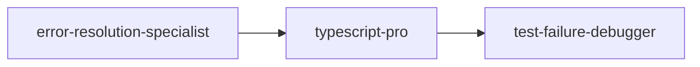
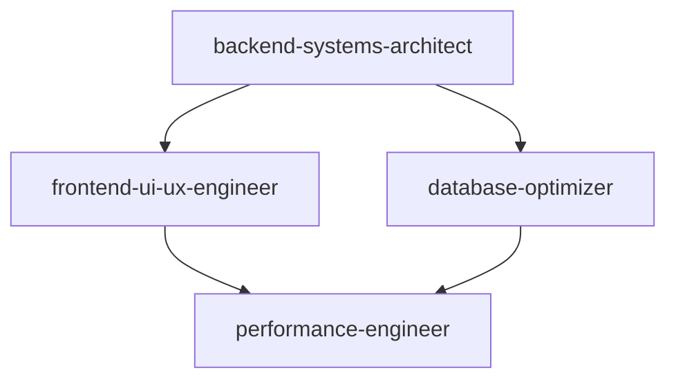

# Claude Code Agent System - Comprehensive Guide

## Overview

This guide provides detailed documentation of all Claude Code agents available in the `.claude/agents/` directory. These agents are specialized tools designed to handle specific development tasks through the Claude Code interface. Each agent has unique capabilities, tools, and workflows optimized for different scenarios.

**Total Agents**: 78+ specialized agents
**Last Updated**: August 12, 2025
**Framework**: Claude Code v2.0+

## Table of Contents

1. [Agent Architecture](#agent-architecture)
2. [Core Development Agents](#core-development-agents)
3. [Backend & Systems Agents](#backend--systems-agents)
4. [Frontend & UI/UX Agents](#frontend--uiux-agents)
5. [DevOps & Infrastructure Agents](#devops--infrastructure-agents)
6. [AI & ML Engineering Agents](#ai--ml-engineering-agents)
7. [Database & Data Agents](#database--data-agents)
8. [Quality & Testing Agents](#quality--testing-agents)
9. [Research & Documentation Agents](#research--documentation-agents)
10. [Business & Analysis Agents](#business--analysis-agents)
11. [Agent Design & Architecture](#agent-design--architecture)
12. [Workflow Orchestration](#workflow-orchestration)
13. [Agent Selection Guide](#agent-selection-guide)

---

## Agent Architecture

### Common Agent Properties

All Claude Code agents follow a standardized structure:

```yaml
---
name: agent-name
description: When and how to use this agent
tools: [List of available MCP tools]
model: inherit|haiku|sonnet  # Model preference
color: red|green|blue|cyan|purple|yellow  # UI color
---
```

### Tool Categories Available

#### Core Development Tools
- **File Operations**: `Read`, `Write`, `Edit`, `MultiEdit`, `Glob`, `Grep`, `LS`
- **Project Management**: `mcp__wslFilesystem__*` (read, write, search, directory operations)
- **Development Support**: `mcp__claude-code-mcp__claude_code`, `mcp__ide__*`, `TodoWrite`
- **Version Control**: Git operations via `Bash`, Task delegation

#### Research & Knowledge Tools  
- **Deep Research**: `mcp__vectorize__*` (retrieve, extract, deep-research)
- **Documentation**: `mcp__context7__*` (resolve-library-id, get-library-docs)
- **Web Research**: `mcp__Bright_Data__*`, `WebFetch`, `WebSearch`
- **Knowledge Management**: `mcp__memory__*` (entities, relations, observations)

#### Testing & Automation Tools
- **Browser Automation**: `mcp__playwright__*` (50+ browser commands)
- **Web Scraping**: `mcp__puppeteer__*`, `mcp__Bright_Data__scraping_browser_*`
- **Testing Support**: Browser console, network monitoring, screenshot capture

#### Data & Storage Tools
- **Cache Management**: `mcp__redis__*` (set, get, delete, list)
- **Vector Operations**: `mcp__vectorize__*` for semantic search and RAG
- **External Storage**: `mcp__gdrive__*` for Google Drive integration

#### AI & Processing Tools
- **Sequential Thinking**: `mcp__sequential__sequentialthinking` for complex analysis
- **LLM Integration**: Built-in support for local and cloud-based models
- **Content Processing**: `mcp__youtube-transcript__*`, `mcp__mastra__*`

#### Specialized Domain Tools
- **Financial Data**: `mcp__Bright_Data__web_data_yahoo_finance_business`
- **E-commerce**: `mcp__Bright_Data__web_data_*` (Amazon, Walmart, eBay products)
- **Social Media**: `mcp__Bright_Data__web_data_*` (LinkedIn, Instagram, TikTok)
- **News & Research**: `mcp__Bright_Data__web_data_*` (Reuters, GitHub repositories)

---

## Core Development Agents

### backend-systems-architect ⭐
**Color**: Green | **Model**: Inherit

**Purpose**: Expert analysis of backend TypeScript systems with focus on production standards.

**Core Capabilities**:
- TypeScript type system analysis (conditional types, mapped types, type guards)
- Backend architecture design (microservices, monoliths, serverless)
- Database integration and ORM optimization
- API design (REST, GraphQL, gRPC)
- Full-stack integration analysis

**Available Tools** (60+ tools):
- **Core File Operations**: `Read`, `Edit`, `MultiEdit`, `Write`, `Glob`, `Grep`, `LS`
- **Project Analysis**: `mcp__wslFilesystem__*` (read, search, analyze project structure)
- **Research & Documentation**: `mcp__vectorize__*` (deep research, extract, retrieve), `mcp__context7__*` (library docs)
- **Knowledge Management**: `mcp__memory__*` (create entities, track patterns, search decisions)
- **Browser Testing**: `mcp__playwright__*` (test endpoints, debug UI integration)
- **Development Support**: `mcp__claude-code-mcp__claude_code`, `mcp__ide__*` (diagnostics, code execution)
- **Data Analysis**: `mcp__Bright_Data__*` (web research, GitHub analysis)

**Tool-to-Task Mapping**:
```yaml
Type Safety Analysis:
  - mcp__wslFilesystem__search_files: Find all .ts/.tsx files
  - Read/Grep: Examine type definitions and usage patterns
  - mcp__ide__getDiagnostics: Get TypeScript compiler errors
  - Edit/MultiEdit: Fix type errors with precise changes

Production Readiness Check:
  - mcp__wslFilesystem__directory_tree: Analyze project structure
  - Grep: Search for mock data, console.log, TODO comments
  - mcp__vectorize__deep_research: Research best practices
  - mcp__memory__create_entities: Document quality issues

End-to-End Flow Tracing:
  - mcp__wslFilesystem__read_multiple_files: Read related components
  - mcp__playwright__browser_*: Test user workflows
  - mcp__memory__create_relations: Map data flow relationships
```

**When to Use**:
- ✅ After implementing new backend features
- ✅ TypeScript type errors and undefined references  
- ✅ Production readiness assessment
- ✅ End-to-end data flow tracing
- ✅ Code quality reviews for backend systems

**Key Features**:
- Holistic codebase understanding using vectorize tools
- Production-quality code enforcement with IDE diagnostics
- Type safety analysis with zero tolerance for `any` types
- Mock data and placeholder detection via filesystem search
- Complete user journey tracing with browser automation

**Tool Workflow Example**:
```typescript
// 1. Use mcp__ide__getDiagnostics to find type errors
// 2. Use mcp__wslFilesystem__search_files to locate related files  
// 3. Use mcp__vectorize__deep_research to find best practices
// 4. Use Edit to apply fixes with proper type safety
// 5. Use mcp__memory__create_entities to document decisions

async function processOrder(orderId: string): Promise<OrderResult> {
  // Agent flags missing error handling via diagnostics
  const order = await db.orders.findById(orderId);
  // Agent suggests proper null checks via research
  return order.process();
}
```

### error-resolution-specialist ⭐
**Color**: Red | **Model**: Inherit

**Purpose**: Comprehensive error diagnosis and resolution for software projects.

**Available Tools** (40+ specialized tools):
- **Error Analysis**: `mcp__wslFilesystem__read_file` (logs), `mcp__playwright__browser_console_messages`
- **Pattern Searching**: `Grep`, `mcp__wslFilesystem__search_files`, `mcp__sequential__sequentialthinking`
- **Code Investigation**: `mcp__wslFilesystem__read_multiple_files`, `mcp__wslFilesystem__directory_tree`
- **Solution Research**: `mcp__context7__get-library-docs`, `mcp__vectorize__deep-research`, `mcp__Bright_Data__*`
- **Cache Management**: `mcp__redis__get/set` (cache solutions), `mcp__memory__search_nodes`
- **Fix Implementation**: `mcp__wslFilesystem__edit_file`, `mcp__claude-code-mcp__claude_code`
- **Testing & Verification**: `mcp__playwright__browser_*`, browser automation tools

**5-Stage Debugging Workflow**:
```yaml
Stage 1 - Initial Analysis:
  - mcp__wslFilesystem__read_file: Read error logs and stack traces
  - Grep: Search for error patterns across codebase
  - mcp__playwright__browser_console_messages: Check browser errors
  - mcp__sequential__sequentialthinking: Break down complex errors

Stage 2 - Deep Investigation:
  - mcp__wslFilesystem__read_multiple_files: Examine related components
  - mcp__wslFilesystem__directory_tree: Analyze project structure
  - mcp__memory__search_nodes: Check for similar past errors
  - mcp__wslFilesystem__search_files: Locate dependency issues

Stage 3 - Research Solutions:
  - mcp__context7__get-library-docs: Search documentation
  - mcp__vectorize__deep-research: Find similar issues and solutions
  - mcp__redis__get: Check cached solutions
  - mcp__Bright_Data__search_engine: Research error messages

Stage 4 - Apply Fixes:
  - mcp__wslFilesystem__edit_file: Implement precise fixes
  - mcp__claude-code-mcp__claude_code: Test fixes
  - mcp__memory__create_entities: Document the solution

Stage 5 - Verify & Document:
  - mcp__playwright__browser_*: Verify fixes work in browser
  - mcp__redis__set: Cache successful solutions
  - mcp__memory__add_observations: Update knowledge graph
```

**Error-Specific Tool Usage**:
- **TypeScript Errors**: `mcp__ide__getDiagnostics` → `mcp__wslFilesystem__edit_file` → `mcp__claude-code-mcp__claude_code "tsc --noEmit"`
- **Runtime Errors**: `mcp__playwright__browser_console_messages` → `mcp__playwright__browser_evaluate` → `mcp__playwright__browser_network_requests`
- **Build Errors**: `mcp__wslFilesystem__read_multiple_files` → `mcp__wslFilesystem__search_files` → config file fixes
- **Dependency Conflicts**: Package analysis → version management via filesystem tools

**When to Use**:
- ✅ TypeScript compilation errors
- ✅ Build failures and module resolution issues
- ✅ API errors and runtime exceptions
- ✅ Dependency conflicts
- ✅ Any debugging scenario requiring systematic approach

**Tool Workflow Example**:
```bash
# Error: "Property 'foo' does not exist on type 'Bar'"
1. mcp__wslFilesystem__search_files → Find all references to 'Bar' type
2. mcp__context7__get-library-docs → Research TypeScript patterns  
3. mcp__vectorize__deep-research → Find similar type errors
4. mcp__wslFilesystem__edit_file → Add missing property to interface
5. mcp__memory__create_entities → Document solution for future reference
```

### typescript-pro ⭐
**Color**: Default | **Model**: Inherit

**Purpose**: Advanced TypeScript expertise for complex type systems and enterprise patterns.

**Advanced Capabilities**:
- Generics with complex constraints
- Conditional types with distributed conditionals
- Mapped types with key remapping
- Template literal types and recursive aliases
- Strict compiler configuration optimization

**Problem-Solving Framework**:
1. Analyze type requirements and constraints
2. Consider multiple approaches with trade-offs
3. Provide type-safe solutions with good DX
4. Include escape hatches with documentation
5. Suggest incremental adoption strategies

**When to Use**:
- ✅ Complex type inference challenges
- ✅ Advanced utility type creation
- ✅ Enterprise TypeScript architecture
- ✅ Compiler configuration optimization
- ✅ Type system design decisions

---

## Backend & Systems Agents

### database-optimizer ⭐
**Color**: Green | **Model**: Inherit

**Purpose**: Database performance optimization and schema design expert.

**Available Tools** (35+ database-focused tools):
- **Core Analysis**: `Read`, `Edit`, `MultiEdit`, `Grep`, `mcp__wslFilesystem__*`
- **Performance Research**: `mcp__vectorize__deep-research`, `mcp__context7__get-library-docs`
- **Query Analysis**: `mcp__sequential__sequentialthinking`, `mcp__claude-code-mcp__claude_code`
- **Knowledge Management**: `mcp__memory__*` (track optimizations, patterns)
- **Cache Management**: `mcp__redis__*` (Redis optimization, TTL strategies)
- **Web Research**: `mcp__Bright_Data__*`, `WebSearch` (database best practices)

**5-Stage Optimization Methodology & Tools**:
```yaml
Stage 1 - Measure First:
  - mcp__wslFilesystem__read_file: Read database logs and query performance
  - mcp__claude-code-mcp__claude_code: Run EXPLAIN ANALYZE commands
  - mcp__memory__create_entities: Document baseline performance metrics
  - Grep: Find slow query patterns across codebase

Stage 2 - Index Strategically:
  - mcp__vectorize__deep-research: Research indexing strategies for specific patterns
  - mcp__context7__get-library-docs: Study database-specific index features
  - mcp__memory__search_nodes: Check past index solutions
  - mcp__sequential__sequentialthinking: Analyze selectivity and cardinality

Stage 3 - Denormalize Judiciously:
  - mcp__wslFilesystem__search_files: Analyze read vs write patterns
  - mcp__memory__create_relations: Map data relationship impacts
  - mcp__vectorize__deep-research: Research denormalization trade-offs

Stage 4 - Cache Intelligently:
  - mcp__redis__*: Implement and test caching strategies
  - mcp__context7__get-library-docs: Research cache invalidation patterns
  - mcp__memory__add_observations: Track cache hit rates and TTL effectiveness

Stage 5 - Monitor Continuously:
  - mcp__claude-code-mcp__claude_code: Create monitoring queries
  - mcp__memory__create_entities: Set up performance tracking
  - mcp__redis__*: Monitor cache performance metrics
```

**Tool-Specific Database Tasks**:
```yaml
Query Optimization:
  - mcp__wslFilesystem__read_file: Read slow query logs
  - mcp__sequential__sequentialthinking: Break down complex queries
  - mcp__claude-code-mcp__claude_code: Test optimized queries
  - Edit: Apply optimizations with before/after documentation

Schema Design:
  - mcp__vectorize__deep-research: Research schema patterns
  - mcp__memory__create_relations: Model entity relationships  
  - mcp__context7__get-library-docs: Study database-specific features
  - MultiEdit: Implement schema changes with rollback scripts

Migration Planning:
  - mcp__wslFilesystem__read_multiple_files: Analyze existing schema
  - mcp__memory__search_nodes: Check past migration patterns
  - mcp__sequential__sequentialthinking: Plan migration steps
  - Write: Create migration and rollback scripts

Caching Implementation:
  - mcp__redis__set/get/delete: Implement Redis caching
  - mcp__vectorize__deep-research: Research cache patterns
  - mcp__memory__add_observations: Track cache effectiveness
  - mcp__claude-code-mcp__claude_code: Test cache invalidation
```

**Tool Workflow Example**:
```sql
-- Slow Query Optimization Process:
1. mcp__wslFilesystem__read_file('/var/log/mysql/slow.log') 
   → Identify problematic queries
2. mcp__claude-code-mcp__claude_code('EXPLAIN ANALYZE SELECT...')  
   → Analyze execution plan
3. mcp__vectorize__deep-research('MySQL index optimization patterns')  
   → Research solutions
4. Edit: Add optimized indexes with proper documentation
5. mcp__memory__create_entities: Document optimization results
6. mcp__redis__set: Cache frequently accessed results
```

**When to Use**:
- ✅ Slow database queries (>1s response times)
- ✅ N+1 query problems
- ✅ Schema design for new features
- ✅ Database migration planning
- ✅ Caching strategy implementation

### performance-engineer ⭐
**Color**: Purple | **Model**: Inherit

**Purpose**: Application performance optimization and scalability specialist.

**Analysis Framework**:
- Profile entire request lifecycle (browser to database)
- Identify synchronous operations for async conversion
- Check for missing indexes and query optimization
- Analyze bundle sizes and code splitting
- Review caching strategies and TTL policies

**Core Tools**:
- **Profiling**: Chrome DevTools, Node.js profiler, flamegraphs
- **Load Testing**: JMeter, k6, Locust, Gatling
- **Monitoring**: Datadog, New Relic, Prometheus/Grafana
- **Caching**: Redis, Memcached, Varnish, CDN

**When to Use**:
- ✅ Application performance bottlenecks
- ✅ Load testing for product launches
- ✅ Database query optimization
- ✅ Frontend performance (Core Web Vitals)
- ✅ API response time optimization

### network-engineer
**Color**: Default | **Model**: Inherit

**Purpose**: Network connectivity, load balancing, and traffic analysis.

**Capabilities**:
- Network connectivity debugging
- Load balancer configuration
- Traffic pattern analysis
- DNS and SSL/TLS management
- CDN setup and optimization

**When to Use**:
- ✅ Network connectivity issues
- ✅ Load balancer configuration
- ✅ SSL/TLS certificate problems
- ✅ DNS resolution issues
- ✅ CDN optimization

---

## Frontend & UI/UX Agents

### frontend-ui-ux-engineer ⭐
**Color**: Cyan | **Model**: Default

**Purpose**: Expert frontend development with React/Next.js, TypeScript, and modern UI/UX.

**Available Tools** (50+ specialized tools):
- **Core Development**: `Read`, `Edit`, `MultiEdit`, `Write`, `Glob`, `Grep`, `LS`
- **Project Management**: `mcp__wslFilesystem__*` (complete filesystem operations)
- **Browser Testing**: `mcp__playwright__*`, `mcp__puppeteer__*`, `mcp__Bright_Data__scraping_browser_*`
- **Research Tools**: `mcp__vectorize__*`, `mcp__context7__*`, `mcp__Bright_Data__*`
- **Knowledge Management**: `mcp__memory__*` (track patterns, decisions)
- **Development Support**: `mcp__claude-code-mcp__claude_code`, `TodoWrite`

**Core Expertise & Tool Mapping**:
```yaml
React/Next.js Development:
  - mcp__wslFilesystem__read_multiple_files: Read existing components for patterns
  - mcp__context7__resolve-library-id + get-library-docs: Research React/Next.js APIs
  - mcp__playwright__browser_*: Test component behavior
  - Edit/MultiEdit: Create/modify components following project patterns

TypeScript Integration:
  - mcp__wslFilesystem__search_files: Find type definitions across project
  - mcp__vectorize__deep-research: Research TypeScript patterns
  - mcp__memory__search_nodes: Check past type solutions
  - mcp__claude-code-mcp__claude_code: Validate TypeScript compilation

UI/UX Implementation:
  - mcp__playwright__browser_screenshot: Visual testing and validation
  - mcp__puppeteer__puppeteer_*: Automated UI testing
  - mcp__Bright_Data__scraping_browser_*: Analyze existing UI patterns
  - mcp__playwright__browser_resize: Test responsive design

API Integration:
  - mcp__playwright__browser_network_requests: Monitor API calls
  - mcp__vectorize__retrieve: Research API integration patterns
  - mcp__memory__create_entities: Document API patterns
  - WebFetch: Test API endpoints during development

Database Connectivity:
  - mcp__context7__get-library-docs: Research database client libraries
  - mcp__memory__create_relations: Map frontend-to-database relationships
  - mcp__redis__*: Work with Redis for session/cache management
```

**Working Principles & Tool Usage**:
1. **Research First**: Use `mcp__vectorize__deep-research` + `mcp__context7__*` before implementing
2. **Never Guess**: Always verify through `mcp__wslFilesystem__read_*` for existing patterns
3. **Follow Project Patterns**: Use `mcp__wslFilesystem__search_files` to find similar implementations
4. **Systematic Debugging**: `mcp__playwright__browser_console_messages` + browser dev tools
5. **Type Safety**: `mcp__claude-code-mcp__claude_code` for TypeScript validation
6. **Clean Architecture**: `mcp__memory__create_entities` to document reusable patterns

**Tool Workflow Example**:
```typescript
// Creating a new data table component:
1. mcp__wslFilesystem__search_files("*.tsx", "table|grid") 
   → Find existing table patterns
2. mcp__context7__get-library-docs("react") 
   → Research React table libraries
3. mcp__vectorize__deep-research("responsive data table patterns") 
   → Get best practices
4. Edit: Create component with proper TypeScript types
5. mcp__playwright__browser_*: Test responsiveness and functionality
6. mcp__memory__create_entities: Document the pattern for reuse
```

**When to Use**:
- ✅ React/Next.js component development
- ✅ TypeScript frontend issues
- ✅ Tailwind CSS styling challenges  
- ✅ API integration from frontend
- ✅ Database connectivity from UI
- ✅ Frontend performance optimization

### ui-ux-designer
**Color**: Default | **Model**: Inherit

**Purpose**: Interface design, wireframes, and design systems.

**Capabilities**:
- User research and persona development
- Wireframing and prototyping
- Design system creation
- Accessibility standards (WCAG)
- User flow optimization
- Interface design patterns

**When to Use**:
- ✅ Design system development
- ✅ User experience optimization
- ✅ Interface wireframing
- ✅ Accessibility improvements
- ✅ User flow design

---

## DevOps & Infrastructure Agents

### deployment-engineer ⭐
**Color**: Default | **Model**: Inherit

**Purpose**: CI/CD pipelines, containerization, and cloud deployment specialist.

**Capabilities**:
- CI/CD pipeline configuration (GitHub Actions, Jenkins)
- Docker containerization and orchestration
- Kubernetes cluster management
- Cloud deployment (AWS, GCP, Azure)
- Infrastructure automation

**When to Use**:
- ✅ CI/CD pipeline setup
- ✅ Docker container configuration
- ✅ Kubernetes deployment
- ✅ Cloud infrastructure setup
- ✅ Deployment automation

### cloud-architect ⭐
**Color**: Default | **Model**: Inherit

**Purpose**: Cloud infrastructure design and cost optimization.

**Capabilities**:
- AWS/Azure/GCP architecture design
- Terraform Infrastructure as Code
- Auto-scaling and multi-region deployments
- Serverless architecture implementation
- Cloud cost optimization

**When to Use**:
- ✅ Cloud infrastructure design
- ✅ Cost optimization strategies
- ✅ Migration planning
- ✅ Terraform IaC implementation
- ✅ Serverless architecture

### devops-troubleshooter
**Color**: Default | **Model**: Inherit

**Purpose**: Production issue debugging and incident response.

**Capabilities**:
- Production debugging and log analysis
- System outage investigation
- Root cause analysis
- Monitoring and alerting setup
- Incident response procedures

**When to Use**:
- ✅ Production incidents
- ✅ System outages
- ✅ Log analysis and debugging
- ✅ Performance degradation
- ✅ Monitoring setup

---

## AI & ML Engineering Agents

### ai-engineer-llm ⭐
**Color**: Green | **Model**: Inherit

**Purpose**: LLM applications, RAG systems, and AI integration specialist.

**Available Tools** (Full MCP Suite):
- **Core Development**: All standard file operations (`Read`, `Edit`, `MultiEdit`, `Write`)
- **Vector Operations**: `mcp__vectorize__*` (retrieve, extract, deep-research)
- **Knowledge Management**: `mcp__memory__*` (entities, relations, observations, graph operations)
- **Research Tools**: `mcp__context7__*`, `mcp__Bright_Data__*`, `WebFetch`, `WebSearch`
- **Browser Automation**: `mcp__playwright__*`, `mcp__puppeteer__*` (for testing LLM interfaces)
- **Development Support**: `mcp__claude-code-mcp__claude_code`, `mcp__sequential__sequentialthinking`
- **External Integrations**: `mcp__mastra__*`, `mcp__youtube-transcript__*`, `mcp__gdrive__*`

**Core Competencies & Tool Applications**:
```yaml
LLM Integration & Management:
  - mcp__context7__get-library-docs: Research LLM APIs and SDKs
  - mcp__vectorize__deep-research: Find integration patterns and best practices
  - mcp__memory__create_entities: Track model configurations and settings
  - mcp__redis__*: Cache API responses and manage rate limiting

RAG System Implementation:
  - mcp__vectorize__retrieve: Core vector search functionality
  - mcp__vectorize__extract: Document processing and chunking
  - mcp__memory__create_relations: Map document relationships
  - mcp__wslFilesystem__*: Manage document storage and indexing

Prompt Engineering:
  - mcp__sequential__sequentialthinking: Design complex prompt chains
  - mcp__memory__search_nodes: Find successful prompt patterns
  - mcp__redis__*: Cache and version prompts
  - mcp__claude-code-mcp__claude_code: Test prompt implementations

Multi-Agent Orchestration:
  - mcp__memory__create_relations: Map agent workflows and dependencies  
  - mcp__redis__*: Manage agent state and communication
  - mcp__sequential__sequentialthinking: Design agent interaction patterns
  - Task: Coordinate with other specialized agents

Vector Database Integration:
  - mcp__vectorize__*: Direct vector operations
  - mcp__context7__*: Research vector database APIs
  - mcp__memory__*: Store embedding metadata and relationships
  - mcp__wslFilesystem__*: Manage vector indexes and data files

Cost & Performance Optimization:
  - mcp__redis__*: Implement caching strategies
  - mcp__memory__add_observations: Track usage patterns and costs
  - mcp__vectorize__retrieve: Optimize vector queries
  - mcp__claude-code-mcp__claude_code: Performance testing
```

**4-Stage Development Approach**:
```yaml
Stage 1 - Start Simple:
  - mcp__context7__get-library-docs: Research basic LLM APIs
  - mcp__sequential__sequentialthinking: Design simple prompt flows
  - mcp__claude-code-mcp__claude_code: Test basic integration

Stage 2 - Build for Reliability:
  - mcp__memory__create_entities: Document error patterns
  - mcp__redis__*: Implement fallback caching
  - mcp__vectorize__deep-research: Research error handling patterns

Stage 3 - Optimize Performance:
  - mcp__memory__search_nodes: Analyze usage patterns
  - mcp__redis__*: Implement intelligent caching
  - mcp__vectorize__*: Optimize vector operations

Stage 4 - Ensure Quality:
  - mcp__playwright__*: Test LLM interfaces end-to-end
  - mcp__memory__add_observations: Track quality metrics
  - mcp__sequential__sequentialthinking: Design validation workflows
```

**Tool Workflow Example - RAG System**:
```python
# 1. mcp__vectorize__extract: Process and chunk documents
# 2. mcp__memory__create_entities: Store document metadata
# 3. mcp__vectorize__retrieve: Implement similarity search
# 4. mcp__redis__set: Cache frequent queries
# 5. mcp__playwright__browser_*: Test the chat interface
# 6. mcp__memory__create_relations: Map query-to-document relationships

def build_rag_system():
    # Use vectorize tools for core functionality
    # Use memory tools for metadata management
    # Use redis for caching layer
    # Use browser tools for UI testing
```

**When to Use**:
- ✅ LLM application development
- ✅ RAG system implementation  
- ✅ Chatbot and AI assistant creation
- ✅ Prompt optimization
- ✅ Vector database integration
- ✅ AI agent orchestration

### ml-engineer
**Color**: Default | **Model**: Inherit

**Purpose**: Machine learning pipeline implementation and model deployment.

**Capabilities**:
- ML pipeline design and implementation
- Model serving and deployment
- Feature engineering and data preprocessing
- A/B testing frameworks
- Model monitoring and drift detection

**When to Use**:
- ✅ ML pipeline development
- ✅ Model deployment
- ✅ Feature engineering
- ✅ ML monitoring setup
- ✅ A/B testing implementation

### ml-production-engineer ⭐
**Color**: Default | **Model**: Inherit

**Purpose**: Production-ready ML systems and MLOps infrastructure.

**Capabilities**:
- Production ML model deployment
- Real-time feature engineering pipelines
- A/B testing for model comparison
- ML monitoring and alerting
- MLOps infrastructure setup

**When to Use**:
- ✅ ML model production deployment
- ✅ Real-time ML pipelines
- ✅ Model A/B testing
- ✅ ML monitoring systems
- ✅ MLOps infrastructure

---

## Database & Data Agents

### data-scientist-sql ⭐
**Color**: Default | **Model**: Default

**Purpose**: SQL-based data analysis and database optimization specialist.

**Capabilities**:
- Complex SQL query development
- Database schema design
- ETL pipeline creation
- Statistical analysis with SQL
- Data visualization from SQL results
- Query performance optimization

**When to Use**:
- ✅ Complex SQL analysis
- ✅ Database performance optimization
- ✅ ETL pipeline development
- ✅ Statistical analysis with databases
- ✅ Data visualization preparation

### database-admin-ops ⭐
**Color**: Default | **Model**: Inherit

**Purpose**: Database operations, backup, and disaster recovery management.

**Capabilities**:
- Database backup and replication strategies
- User permission management
- Database monitoring and maintenance
- Disaster recovery planning
- Performance tuning and optimization

**When to Use**:
- ✅ Database backup strategies
- ✅ Replication setup
- ✅ User permission management
- ✅ Disaster recovery planning
- ✅ Database maintenance tasks

### data-engineer
**Color**: Default | **Model**: Inherit

**Purpose**: ETL pipelines, data warehouses, and streaming architectures.

**Capabilities**:
- ETL/ELT pipeline development
- Data warehouse design
- Streaming data processing (Kafka, Spark)
- Data pipeline orchestration (Airflow)
- Data quality monitoring

**When to Use**:
- ✅ ETL pipeline development
- ✅ Data warehouse architecture
- ✅ Streaming data processing
- ✅ Data pipeline orchestration
- ✅ Data quality assurance

---

## Quality & Testing Agents

### test-failure-debugger ⭐
**Color**: Default | **Model**: Inherit

**Purpose**: Debugging failing tests and improving test suite reliability.

**Capabilities**:
- Test failure analysis and debugging
- Flaky test identification and fixes
- Mock configuration troubleshooting
- Test isolation and race condition fixes
- Jest, Vitest, and Playwright expertise

**When to Use**:
- ✅ Failing or flaky tests
- ✅ Test timeout issues
- ✅ Mock configuration problems
- ✅ Test isolation issues
- ✅ Test framework migration

### test-automator
**Color**: Default | **Model**: Inherit

**Purpose**: Comprehensive test suite creation and automation.

**Capabilities**:
- Unit, integration, and E2E test creation
- Test automation pipeline setup
- Mocking strategies and test data
- CI/CD test integration
- Test coverage optimization

**When to Use**:
- ✅ Test suite development
- ✅ Test automation setup
- ✅ Testing strategy design
- ✅ CI/CD test integration
- ✅ Test coverage improvement

### security-auditor
**Color**: Default | **Model**: Inherit

**Purpose**: Security vulnerability assessment and mitigation.

**Capabilities**:
- Code security review and vulnerability scanning
- Authentication and authorization implementation
- OWASP compliance and security standards
- Security testing and penetration testing
- Security incident response

**When to Use**:
- ✅ Security code reviews
- ✅ Vulnerability assessments
- ✅ Authentication system design
- ✅ Security compliance checks
- ✅ Security incident analysis

---

## Research & Documentation Agents

### search-specialist ⭐
**Color**: Purple | **Model**: Haiku

**Purpose**: Expert web research using advanced search techniques and synthesis.

**Search Strategies**:
- Query optimization with exact phrases and exclusions
- Domain filtering for trusted sources
- Multi-source verification and fact-checking
- Historical and trend analysis
- Deep content extraction with WebFetch

**Approach**:
1. Understand research objective clearly
2. Create 3-5 query variations for coverage
3. Search broadly first, then refine
4. Verify facts across multiple sources
5. Track contradictions and consensus

**When to Use**:
- ✅ Deep research projects
- ✅ Competitive analysis
- ✅ Fact-checking and verification
- ✅ Trend analysis
- ✅ Information synthesis

### reference-builder ⭐
**Color**: Default | **Model**: Default

**Purpose**: Exhaustive technical references and API documentation.

**Capabilities**:
- Comprehensive API documentation
- Configuration guides and references
- Technical specification creation
- Parameter and option documentation
- Searchable reference material generation

**When to Use**:
- ✅ API documentation creation
- ✅ Configuration reference guides
- ✅ Technical specification writing
- ✅ Complete parameter documentation
- ✅ Reference material generation

### docs-architect
**Color**: Default | **Model**: Inherit

**Purpose**: Comprehensive technical documentation from codebases.

**Capabilities**:
- System architecture documentation
- Design pattern analysis
- Technical manual creation
- Code-to-documentation generation
- Long-form technical writing

**When to Use**:
- ✅ System documentation
- ✅ Architecture guides
- ✅ Technical deep-dives
- ✅ Code documentation
- ✅ Technical manual creation

---

## Business & Analysis Agents

### business-analyst-metrics ⭐
**Color**: Default | **Model**: Inherit

**Purpose**: Business metrics analysis, KPI tracking, and performance reporting.

**Capabilities**:
- Business metrics analysis and KPI development
- Performance dashboard creation
- Revenue model development
- Growth projection and forecasting
- Investor report preparation

**When to Use**:
- ✅ Business metrics analysis
- ✅ KPI dashboard creation
- ✅ Revenue analysis
- ✅ Growth projection
- ✅ Investor presentations

### context-manager ⭐
**Color**: Cyan | **Model**: Inherit

**Purpose**: Multi-agent workflow coordination and context preservation.

**Primary Functions**:
- **Context Capture**: Extract key decisions and patterns
- **Context Distribution**: Prepare agent-specific briefings
- **Memory Management**: Store critical decisions with timestamps
- **Token Management**: Monitor usage and recommend compression

**Context Formats**:
- **Quick Context** (<500 tokens): Current tasks and immediate goals
- **Full Context** (<2000 tokens): Architecture overview and decisions
- **Archived Context**: Historical decisions and pattern library

**When to Use**:
- ✅ Complex multi-agent workflows
- ✅ Projects exceeding 10k tokens
- ✅ Long-running project coordination
- ✅ Context preservation across sessions
- ✅ Agent handoff coordination

---

## Agent Design & Architecture

### agent-architect ⭐
**Color**: Default | **Model**: Inherit

**Purpose**: Master designer of AI agent configurations and the ultimate authority on agent creation best practices.

**Core Responsibilities**:
- **Agent Design Architecture** - Create comprehensive agent specifications including persona design, capability mapping, and behavioral parameters
- **Tool Selection & Integration** - Recommend optimal tool combinations based on agent requirements and available capabilities  
- **Naming & Organization Standards** - Establish consistent naming conventions using lowercase-hyphen format
- **Best Practice Enforcement** - Ensure all agents follow established patterns for system prompts and behavioral guidelines
- **Workflow Integration Planning** - Design agents that work cohesively within larger agent ecosystems

**Design Methodology**:
1. **Requirements Analysis** - Extract explicit and implicit needs from user descriptions
2. **Domain Expertise Mapping** - Identify specific knowledge domains and skill sets required
3. **Capability Specification** - Define precise operational parameters and success criteria
4. **Integration Planning** - Consider how the agent fits into existing workflows
5. **Quality Assurance** - Build in self-verification mechanisms and error handling

**Agent Creation Standards**:
- Use descriptive, function-specific identifiers (avoid generic terms like 'helper' or 'assistant')
- Create compelling expert personas that inspire confidence and guide decision-making
- Include specific methodologies and frameworks relevant to the domain
- Anticipate edge cases and provide clear guidance for handling them
- Define clear output format expectations and quality standards
- Incorporate escalation strategies for complex scenarios

**When to Use**:
- ✅ Creating specialized agents for specific workflows
- ✅ Designing agent suites for complex projects  
- ✅ Establishing agent naming and organization standards
- ✅ Planning multi-agent workflow integration
- ✅ Optimizing tool selection for agent capabilities
- ✅ Ensuring consistency across agent ecosystems

**Key Features**:
- Complete agent specification generation
- Tool combination optimization  
- Quality assurance built into design process
- Long-term maintainability and scalability consideration
- Integration potential analysis

**Example Workflow**:
```yaml
Agent Request: "I need an agent for Python code security reviews"
↓
Requirements Analysis: Security focus + Python expertise + Code review
↓  
Domain Mapping: Security auditing + Python language + Code analysis
↓
Tool Selection: Code analysis + Security scanning + Documentation
↓
Agent Specification: Complete configuration with persona and capabilities
```

---

## Workflow Orchestration

### Agent Collaboration Patterns

#### Sequential Workflows


**Use Case**: Debugging TypeScript errors in test files
1. **error-resolution-specialist** identifies the core issue
2. **typescript-pro** fixes complex type problems
3. **test-failure-debugger** ensures tests pass

#### Parallel Workflows


**Use Case**: Full-stack feature development
- **backend-systems-architect** & **database-optimizer** handle backend
- **frontend-ui-ux-engineer** develops UI
- **performance-engineer** optimizes final integration

#### Research-First Workflows


**Use Case**: Implementing new AI features
1. **search-specialist** researches best practices
2. **ai-engineer-llm** implements core AI functionality
3. **typescript-pro** ensures type safety

### Context Handoff Patterns

#### Complex Project Management
```yaml
Phase 1: Architecture Design
  Primary: backend-systems-architect
  Support: database-optimizer, cloud-architect
  
Phase 2: Implementation
  Primary: frontend-ui-ux-engineer, typescript-pro
  Support: error-resolution-specialist
  
Phase 3: Testing & Deployment  
  Primary: test-automator, deployment-engineer
  Support: performance-engineer, security-auditor
  
Coordination: context-manager (throughout)
```

---

## Agent Selection Guide

### By Development Phase

**Planning & Architecture**:
- `backend-systems-architect` - System architecture and design
- `cloud-architect` - Infrastructure planning  
- `database-optimizer` - Data architecture
- `context-manager` - Project coordination
- `agent-architect` - AI agent design and creation

**Implementation**:
- `typescript-pro` - Complex type implementations
- `frontend-ui-ux-engineer` - UI development
- `ai-engineer-llm` - AI feature development
- `error-resolution-specialist` - Bug fixes

**Testing & Quality**:
- `test-automator` - Test suite creation
- `test-failure-debugger` - Test debugging
- `security-auditor` - Security reviews
- `performance-engineer` - Performance optimization

**Deployment & Operations**:
- `deployment-engineer` - CI/CD and deployment
- `devops-troubleshooter` - Production issues
- `database-admin-ops` - Database operations
- `network-engineer` - Infrastructure issues

### By Technology Stack

**TypeScript/JavaScript**:
- `typescript-pro` - Advanced TypeScript
- `frontend-ui-ux-engineer` - React/Next.js
- `javascript-pro` - Modern JavaScript
- `error-resolution-specialist` - Debugging

**Python**:
- `python-pro` - Advanced Python development
- `ml-engineer` - Machine learning
- `data-scientist-sql` - Data analysis
- `ai-engineer-llm` - AI applications

**Infrastructure**:
- `cloud-architect` - Cloud platforms
- `deployment-engineer` - Containerization
- `terraform-specialist` - IaC development
- `network-engineer` - Network configuration

**Databases**:
- `database-optimizer` - Performance optimization
- `database-admin-ops` - Operations and maintenance
- `data-engineer` - ETL and data pipelines
- `data-scientist-sql` - SQL analysis

### By Problem Type

**Performance Issues**:
1. `performance-engineer` - Application profiling
2. `database-optimizer` - Database optimization
3. `cloud-architect` - Infrastructure scaling

**Type Errors**:
1. `error-resolution-specialist` - Error diagnosis
2. `typescript-pro` - Complex type fixes
3. `backend-systems-architect` - System-wide type safety

**Feature Development**:
1. `search-specialist` - Research best practices
2. `backend-systems-architect` - Architecture design
3. `frontend-ui-ux-engineer` - UI implementation
4. `test-automator` - Test coverage

**Production Issues**:
1. `devops-troubleshooter` - Incident response
2. `error-resolution-specialist` - Bug diagnosis
3. `performance-engineer` - Performance analysis
4. `security-auditor` - Security assessment

**Agent Ecosystem Management**:
1. `agent-architect` - Design and create new specialized agents
2. `context-manager` - Coordinate multi-agent workflows
3. `search-specialist` - Research agent capabilities and best practices

---

## Tool Selection and Usage Guide

### Tool Selection Matrix by Task Type

#### Code Analysis & Development
```yaml
TypeScript Development:
  Primary: mcp__ide__getDiagnostics, mcp__claude-code-mcp__claude_code
  Support: mcp__wslFilesystem__search_files, mcp__context7__get-library-docs
  Agents: backend-systems-architect, typescript-pro, frontend-ui-ux-engineer

Database Operations:
  Primary: mcp__redis__*, mcp__claude-code-mcp__claude_code  
  Support: mcp__vectorize__deep-research, mcp__memory__create_relations
  Agents: database-optimizer, database-admin-ops, data-scientist-sql

API Integration:
  Primary: mcp__playwright__browser_network_requests, WebFetch
  Support: mcp__context7__get-library-docs, mcp__memory__create_entities
  Agents: backend-systems-architect, frontend-ui-ux-engineer, ai-engineer-llm
```

#### Research & Documentation
```yaml
Technical Research:
  Primary: mcp__vectorize__deep-research, mcp__context7__*
  Support: mcp__Bright_Data__search_engine, WebSearch
  Agents: search-specialist, reference-builder, docs-architect

Library Documentation:
  Primary: mcp__context7__resolve-library-id, mcp__context7__get-library-docs
  Support: mcp__vectorize__extract, mcp__memory__create_entities
  Agents: reference-builder, api-documenter, tutorial-engineer

Best Practices Research:
  Primary: mcp__vectorize__deep-research, mcp__Bright_Data__scraping_browser_*
  Support: mcp__memory__search_nodes, mcp__redis__get
  Agents: search-specialist, architecture-reviewer
```

#### Testing & Quality Assurance  
```yaml
UI Testing:
  Primary: mcp__playwright__browser_*, mcp__puppeteer__*
  Support: mcp__playwright__browser_console_messages, screenshot tools
  Agents: test-automator, test-failure-debugger, frontend-ui-ux-engineer

Performance Testing:
  Primary: mcp__playwright__browser_network_requests, mcp__claude-code-mcp__claude_code
  Support: mcp__memory__add_observations, mcp__redis__*
  Agents: performance-engineer, database-optimizer

Error Debugging:
  Primary: mcp__wslFilesystem__search_files, mcp__sequential__sequentialthinking
  Support: mcp__playwright__browser_console_messages, mcp__vectorize__deep-research
  Agents: error-resolution-specialist, debugger, test-failure-debugger
```

#### AI & ML Development
```yaml
RAG Systems:
  Primary: mcp__vectorize__*, mcp__memory__*
  Support: mcp__redis__*, mcp__context7__*
  Agents: ai-engineer-llm, ml-engineer, ml-production-engineer

LLM Integration:
  Primary: mcp__sequential__sequentialthinking, mcp__claude-code-mcp__claude_code
  Support: mcp__memory__create_entities, mcp__redis__*
  Agents: ai-engineer-llm, prompt-optimization-expert

Agent Orchestration:
  Primary: Task, mcp__memory__create_relations
  Support: mcp__redis__*, mcp__sequential__sequentialthinking
  Agents: agent-architect, context-manager, ai-engineer-llm
```

### Tool Workflow Patterns

#### Pattern 1: Research → Implement → Test
```yaml
Stage 1 - Research:
  - mcp__vectorize__deep-research: Find best practices
  - mcp__context7__get-library-docs: Study relevant APIs
  - mcp__memory__search_nodes: Check past solutions

Stage 2 - Implement:  
  - mcp__wslFilesystem__read_multiple_files: Understand existing code
  - Edit/MultiEdit: Apply changes following patterns
  - mcp__memory__create_entities: Document decisions

Stage 3 - Test:
  - mcp__claude-code-mcp__claude_code: Run automated tests
  - mcp__playwright__browser_*: Test in browser environment
  - mcp__memory__add_observations: Track results
```

#### Pattern 2: Debug → Research → Fix → Verify
```yaml
Stage 1 - Debug:
  - mcp__wslFilesystem__read_file: Read error logs
  - mcp__playwright__browser_console_messages: Check browser errors
  - mcp__sequential__sequentialthinking: Analyze complex issues

Stage 2 - Research:
  - mcp__vectorize__deep-research: Find similar issues
  - mcp__context7__get-library-docs: Check documentation
  - mcp__redis__get: Check cached solutions

Stage 3 - Fix:
  - mcp__wslFilesystem__edit_file: Apply targeted fixes
  - mcp__memory__create_entities: Document the solution

Stage 4 - Verify:
  - mcp__claude-code-mcp__claude_code: Test the fix
  - mcp__redis__set: Cache successful solutions
```

#### Pattern 3: Analyze → Optimize → Monitor
```yaml
Stage 1 - Analyze:
  - mcp__playwright__browser_network_requests: Profile performance
  - mcp__wslFilesystem__search_files: Find bottlenecks
  - mcp__sequential__sequentialthinking: Break down performance issues

Stage 2 - Optimize:
  - mcp__redis__*: Implement caching strategies
  - mcp__claude-code-mcp__claude_code: Test optimizations
  - mcp__memory__create_relations: Map performance dependencies

Stage 3 - Monitor:
  - mcp__memory__add_observations: Track performance metrics
  - mcp__playwright__browser_*: Ongoing performance testing
```

### Cross-Agent Tool Coordination

#### Multi-Agent Workflows
```yaml
Complex Feature Development:
  1. search-specialist: mcp__vectorize__deep-research for patterns
  2. backend-systems-architect: mcp__wslFilesystem__* for analysis  
  3. frontend-ui-ux-engineer: mcp__playwright__* for UI testing
  4. context-manager: mcp__memory__* for coordination

Production Issue Resolution:
  1. error-resolution-specialist: mcp__sequential__sequentialthinking for analysis
  2. performance-engineer: mcp__playwright__browser_* for profiling
  3. database-optimizer: mcp__redis__* for caching fixes
  4. devops-troubleshooter: monitoring and alerting setup
```

---

## Best Practices for Agent Usage

### Proactive Agent Selection

**Research-First Approach**:
Always start complex projects with `search-specialist` for best practices research, then hand off to implementation agents.

**Multi-Agent Coordination**:
Use `context-manager` for projects involving 3+ agents or sessions exceeding 10k tokens.

**Quality Assurance**:
Automatically engage `test-failure-debugger` after significant code changes and `security-auditor` for security-sensitive features.

### Agent Handoff Strategies

**Sequential Handoffs**:
```
Problem Analysis → error-resolution-specialist
↓
Type Safety Review → typescript-pro  
↓
Production Readiness → backend-systems-architect
```

**Context Preservation**:
Always use `context-manager` when switching between agents to maintain project coherence and decision history.

**Specialization Respect**:
Let agents work in their expertise areas - don't ask `frontend-ui-ux-engineer` to optimize database queries.

---

## Conclusion

The Claude Code agent system provides 78+ specialized agents with access to **150+ MCP tools** covering every aspect of modern software development, including agent creation and ecosystem management. Success depends on:

1. **Proper Agent Selection**: Match agents to specific problem domains and their specialized tool sets
2. **Tool Optimization**: Leverage the right combination of MCP tools for maximum efficiency
3. **Workflow Orchestration**: Use sequential/parallel patterns with coordinated tool usage  
4. **Context Management**: Maintain coherence across multi-agent sessions using memory and redis tools
5. **Proactive Engagement**: Let agents work within their expertise areas using their full tool arsenal
6. **Quality Focus**: Always include testing and security reviews using automation tools

### Key Tool Categories Mastered:
- **150+ MCP Tools**: Complete development ecosystem coverage
- **Browser Automation**: 50+ Playwright commands for comprehensive testing
- **Knowledge Management**: Memory graph, Redis caching, vector operations
- **Research Arsenal**: Deep research, vectorization, context resolution
- **Development Support**: IDE integration, code execution, project management
- **Specialized Data Sources**: E-commerce, social media, financial, and news APIs

Each agent is optimized for specific scenarios and delivers production-ready solutions using the most appropriate tools from their comprehensive toolkit. The combination of specialized expertise and powerful tool access enables sophisticated development workflows while maintaining code quality, performance, and security standards across the entire software development lifecycle.

This comprehensive system transforms development productivity by matching the right expert agent with the right tools for each specific task, creating a highly efficient and effective development environment.