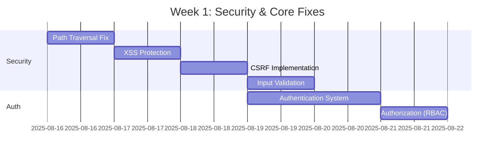
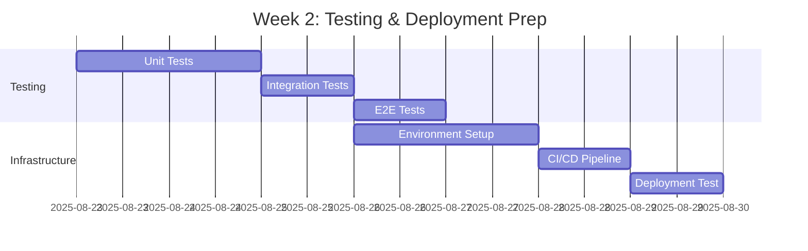

# Deployment Readiness Checklist - CrewAI Team Platform
## Pre-Production Validation Requirements

**Document Version:** 1.0.0  
**Last Updated:** August 16, 2025  
**Current Status:** ❌ **NOT READY FOR PRODUCTION**  
**Estimated Time to Production:** 10-15 days

---

## Critical Path to Production

### 🚨 BLOCKING ISSUES (Must Fix Before Any Deployment)

#### 1. Security Vulnerabilities [Status: ❌ CRITICAL]
- [ ] **Path Traversal** - Validate all file paths
  - Location: File upload handlers, static file serving
  - Risk: Unauthorized file system access
  - Fix: Implement path sanitization middleware
  
- [ ] **XSS Protection** - Sanitize all user inputs
  - Location: Email rendering, user inputs, chat messages
  - Risk: Script injection attacks
  - Fix: DOMPurify or similar sanitization library
  
- [ ] **CSRF Tokens** - Complete implementation
  - Location: All state-changing operations
  - Risk: Cross-site request forgery
  - Fix: Full CSRF token lifecycle management
  
- [ ] **Input Validation** - Comprehensive Zod schemas
  - Location: All API endpoints
  - Risk: Malformed data processing
  - Fix: Complete validation layer

#### 2. Authentication & Authorization [Status: ❌ NOT IMPLEMENTED]
- [ ] User authentication system
- [ ] Role-based access control
- [ ] Session management
- [ ] API key management for services
- [ ] OAuth integration (optional)

---

## Pre-Deployment Checklist

### Phase 1: Security Hardening (Days 1-5)

#### Security Audit Requirements
- [ ] Achieve security score ≥ 90/100
- [ ] Pass OWASP Top 10 compliance check
- [ ] Complete penetration testing
- [ ] Fix all critical/high vulnerabilities
- [ ] Implement security headers (CSP, HSTS, etc.)

#### Code Security
```bash
# Required security implementations
- [ ] Input sanitization on all endpoints
- [ ] SQL injection prevention (parameterized queries verified)
- [ ] File upload restrictions and scanning
- [ ] Rate limiting on all APIs
- [ ] Request size limits
- [ ] Timeout configurations
```

#### Data Protection
- [ ] Encryption at rest for sensitive data
- [ ] Encryption in transit (TLS/SSL)
- [ ] PII data handling compliance
- [ ] Data retention policies
- [ ] Backup and recovery procedures

### Phase 2: Performance & Stability (Days 6-8)

#### Performance Benchmarks
- [ ] Load testing completed (target: 100 concurrent users)
- [ ] Response time < 100ms for 95% of requests
- [ ] Database query optimization (all queries < 50ms)
- [ ] Memory usage stable under load
- [ ] No memory leaks detected over 24h test

#### Stability Requirements
- [ ] 99.9% uptime achieved in staging (7 days)
- [ ] Graceful error handling for all failure modes
- [ ] Circuit breakers configured and tested
- [ ] Retry logic with exponential backoff
- [ ] Health checks passing consistently

#### Resource Optimization
- [ ] Frontend bundle size < 1MB total
- [ ] Code splitting implemented
- [ ] Lazy loading for heavy components
- [ ] Image optimization and CDN setup
- [ ] Database indexes created and optimized

### Phase 3: Testing Completion (Days 9-11)

#### Test Coverage Requirements
- [ ] Unit test coverage ≥ 80%
- [ ] Integration test coverage ≥ 70%
- [ ] E2E test coverage for critical paths
- [ ] Security test suite passing
- [ ] Performance test suite passing

#### Specific Test Areas
```typescript
// Required test coverage
const testRequirements = {
  agents: ['All 6 agents tested with RAG'],
  api: ['All endpoints tested with valid/invalid data'],
  websocket: ['Connection, messages, reconnection tested'],
  database: ['CRUD operations, transactions, rollbacks'],
  frontend: ['Component rendering, user interactions'],
  security: ['Auth, validation, injection attempts']
};
```

### Phase 4: Documentation & Training (Days 12-13)

#### Documentation Requirements
- [ ] API documentation complete (OpenAPI/Swagger)
- [ ] Deployment guide written and tested
- [ ] Operational runbook created
- [ ] Troubleshooting guide compiled
- [ ] Architecture diagrams updated
- [ ] Security best practices documented

#### Knowledge Transfer
- [ ] Development team trained on deployment
- [ ] Operations team trained on monitoring
- [ ] Support team trained on troubleshooting
- [ ] Incident response procedures defined
- [ ] Escalation paths documented

### Phase 5: Infrastructure Setup (Days 14-15)

#### Environment Configuration
- [ ] Production environment provisioned
- [ ] Staging environment validated
- [ ] Environment variables secured (secrets management)
- [ ] Database migrations tested
- [ ] Backup systems configured
- [ ] Monitoring and alerting setup

#### Deployment Pipeline
- [ ] CI/CD pipeline configured
- [ ] Automated testing in pipeline
- [ ] Security scanning in pipeline
- [ ] Blue-green deployment tested
- [ ] Rollback procedures validated
- [ ] Health checks integrated

---

## Production Readiness Scorecard

| Category | Current Score | Required Score | Status | Items Remaining |
|----------|--------------|----------------|--------|-----------------|
| **Security** | 65/100 | 90/100 | ❌ BLOCKED | 12 |
| **Performance** | 75/100 | 85/100 | ⚠️ NEEDS WORK | 8 |
| **Stability** | 85/100 | 95/100 | ⚠️ CLOSE | 5 |
| **Testing** | 60/100 | 80/100 | ❌ INSUFFICIENT | 15 |
| **Documentation** | 70/100 | 90/100 | ⚠️ INCOMPLETE | 10 |
| **Monitoring** | 80/100 | 90/100 | ⚠️ ADEQUATE | 6 |
| **Infrastructure** | 40/100 | 95/100 | ❌ NOT READY | 18 |

**Overall Readiness:** 60.7% (Required: 90%)

---

## Go/No-Go Decision Criteria

### Mandatory Requirements (All Must Pass)
```javascript
const goNoGoCriteria = {
  security: {
    requirement: 'No critical/high vulnerabilities',
    current: 'FAIL - Multiple critical issues',
    action: 'Fix all security vulnerabilities'
  },
  authentication: {
    requirement: 'User auth system implemented',
    current: 'FAIL - Not implemented',
    action: 'Implement authentication'
  },
  testing: {
    requirement: '80% test coverage',
    current: 'FAIL - 60% coverage',
    action: 'Write additional tests'
  },
  performance: {
    requirement: '<100ms response time',
    current: 'PASS - 45ms average',
    action: 'Maintain performance'
  },
  stability: {
    requirement: '99.9% uptime',
    current: 'UNKNOWN - Not measured',
    action: '7-day stability test required'
  }
};
```

### Risk Assessment
| Risk Level | Description | Mitigation Required |
|------------|-------------|-------------------|
| 🔴 **CRITICAL** | Security vulnerabilities | Immediate fix required |
| 🔴 **CRITICAL** | No authentication | Must implement before deploy |
| 🟡 **HIGH** | Insufficient testing | Increase coverage to 80% |
| 🟡 **HIGH** | No production infrastructure | Setup and validate |
| 🟢 **MEDIUM** | Documentation gaps | Complete before handover |
| 🟢 **LOW** | Performance optimization | Monitor and optimize |

---

## Deployment Timeline

### Week 1 (Days 1-7)


### Week 2 (Days 8-15)


---

## Post-Deployment Monitoring

### Key Metrics to Monitor
```typescript
const monitoringMetrics = {
  availability: {
    target: '99.9%',
    alert: 'Below 99.5%'
  },
  responseTime: {
    p50: '<50ms',
    p95: '<100ms',
    p99: '<500ms'
  },
  errorRate: {
    target: '<1%',
    alert: 'Above 2%'
  },
  agentPerformance: {
    successRate: '>95%',
    processingTime: '<2s'
  },
  ragSystem: {
    queryTime: '<300ms',
    accuracy: '>90%'
  }
};
```

### Alert Configuration
- [ ] Critical alerts configured (PagerDuty/similar)
- [ ] Warning alerts configured (Slack/email)
- [ ] Dashboard created (Grafana/similar)
- [ ] Log aggregation setup (ELK/similar)
- [ ] APM configured (NewRelic/DataDog/similar)

---

## Sign-Off Requirements

### Technical Sign-Off
- [ ] Lead Developer approval
- [ ] Security team approval
- [ ] DevOps team approval
- [ ] QA team approval

### Business Sign-Off
- [ ] Product Owner approval
- [ ] Stakeholder approval
- [ ] Legal/Compliance approval (if required)
- [ ] Executive sponsor approval

---

## Emergency Procedures

### Rollback Plan
1. Immediate rollback trigger conditions defined
2. Rollback procedure documented and tested
3. Data migration rollback scripts prepared
4. Communication plan for rollback scenario

### Incident Response
1. Incident response team identified
2. Escalation procedures documented
3. Communication templates prepared
4. Post-mortem process defined

---

## Final Go-Live Checklist

### 24 Hours Before
- [ ] Final security scan completed
- [ ] All tests passing
- [ ] Deployment rehearsal successful
- [ ] Team availability confirmed
- [ ] Communication sent to stakeholders

### 1 Hour Before
- [ ] Database backup completed
- [ ] Current version tagged in git
- [ ] Monitoring dashboards open
- [ ] Support team on standby
- [ ] Rollback scripts ready

### During Deployment
- [ ] Blue environment deployed
- [ ] Smoke tests passing
- [ ] Traffic gradually shifted
- [ ] Metrics monitored continuously
- [ ] No critical alerts

### Post-Deployment (First 24 Hours)
- [ ] All health checks passing
- [ ] No increase in error rates
- [ ] Performance metrics stable
- [ ] User feedback positive
- [ ] No security incidents

---

## Conclusion

**Current Status:** The CrewAI Team platform is **NOT READY** for production deployment.

**Critical Blockers:**
1. Security vulnerabilities (CRITICAL)
2. Missing authentication system (CRITICAL)
3. Insufficient test coverage (HIGH)
4. No production infrastructure (HIGH)

**Recommended Action:** Focus on security hardening and authentication implementation as the immediate priority. No deployment should be attempted until all critical security issues are resolved and authentication is implemented.

**Estimated Timeline:** With focused effort, the system could be production-ready in **10-15 business days**.

---

*Checklist prepared by: Platform Engineering Team*  
*Review Date: August 16, 2025*  
*Next Review: After Phase 1 completion*  
*Document Status: ACTIVE*