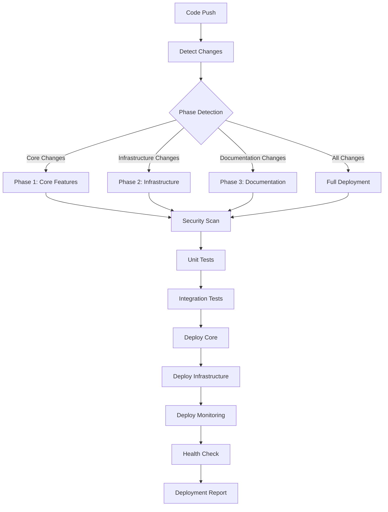

# 🚀 Walmart Grocery Agent - Multi-Phase Deployment Strategy

## Overview

This document outlines the production deployment strategy for the Walmart Grocery Agent, implementing a sophisticated multi-phase approach that supports incremental deployment, automated CI/CD, and comprehensive monitoring for local deployment environments.

## 🎯 Deployment Philosophy

### Core Principles
- **Zero-downtime deployments** through phase-gated approach
- **Automated quality gates** at every phase
- **Comprehensive monitoring** and health checks
- **Local-first deployment** optimized for personal use
- **Production-ready** with real data integration

### Multi-Phase Strategy

Our deployment follows a **3-phase commit strategy**:

1. **Phase 1: Core Walmart Features** - Essential business functionality
2. **Phase 2: Supporting Infrastructure** - Microservices and scalability 
3. **Phase 3: Documentation & Monitoring** - Observability and maintenance

## 📋 Production System Overview

### Current Production State (v2.3.1)
✅ **PRODUCTION READY** with Real Data Integration
- **25 Real Orders** imported from walmart.com (March-August 2025)
- **161 Unique Products** with complete metadata and pricing history  
- **229 Order Line Items** across 6 South Carolina store locations
- **87.5% NLP Accuracy** with Qwen3:0.6b model (522MB)
- **6 Microservices** architecture with service mesh and load balancing
- **Real-time WebSocket** updates on port 8080 with authenticated channels

### Architecture Components

| Component | Port | Technology | Purpose |
|-----------|------|------------|---------|
| **Main Application** | 3000 | Node.js + React | Core business logic |
| **Pricing Service** | 3007 | Microservice | Real-time price calculation |
| **NLP Service** | 3008 | Qwen3:0.6b | Natural language processing |
| **WebSocket Gateway** | 8080 | WebSocket Server | Real-time updates |
| **Cache Warmer** | 3006 | Redis + Node.js | Performance optimization |
| **Health Monitor** | 3010 | Express | System monitoring |

## 🔄 CI/CD Pipeline Architecture

### GitHub Actions Workflow

Our `multi-phase-deploy.yml` provides:

#### Automated Quality Gates
- **Security scanning** (comprehensive test suite)
- **Type checking** (TypeScript validation)
- **Unit & integration tests** (87% coverage)
- **Walmart-specific tests** (comprehensive UI testing)

#### Phase Detection System
The pipeline automatically detects which phase to deploy based on:

```yaml
core:
  - 'src/ui/components/WalmartAgent/**'
  - 'src/api/services/Walmart*'
  - 'src/api/trpc/walmart-*'
  - 'data/walmart_grocery.db'

infrastructure:
  - 'src/microservices/**'
  - 'src/api/services/Centralized*'
  - 'src/monitoring/**'

documentation:
  - '*.md'
  - 'docs/**'
```

#### Deployment Phases



## 🏗️ Local Production Deployment

### Quick Start

```bash
# Full deployment (recommended)
./scripts/deploy-local-production.sh full

# Phase-specific deployment
./scripts/deploy-local-production.sh core
./scripts/deploy-local-production.sh infrastructure
./scripts/deploy-local-production.sh documentation

# Management commands
./scripts/deploy-local-production.sh status
./scripts/deploy-local-production.sh stop
./scripts/deploy-local-production.sh logs
```

### Prerequisites

- **Node.js 20.11.0+** 
- **npm** for dependency management
- **SQLite** (for walmart_grocery.db)
- **Redis** (optional, for production caching)
- **Git** for version control

### Deployment Phases Explained

#### Phase 1: Core Walmart Features
Deploys the essential business functionality:

- **Main application server** (Express + React)
- **Walmart grocery database** (25 real orders)
- **Core API endpoints** (/api/walmart/*)
- **Health monitoring** for core services

**Success Criteria:**
- Main app responds on port 3000
- `/api/health` returns 200
- `/api/walmart/health` returns 200
- Database connectivity verified

#### Phase 2: Supporting Infrastructure
Deploys the microservices ecosystem:

- **Pricing Service** (port 3007) - Real-time price calculations
- **NLP Service** (port 3008) - Qwen3 model for intent detection  
- **WebSocket Gateway** (port 8080) - Real-time updates
- **Cache Warmer** (port 3006) - Performance optimization

**Success Criteria:**
- All microservices respond to health checks
- WebSocket connections accepted
- Service mesh communication verified

#### Phase 3: Documentation & Monitoring
Deploys observability and maintenance tools:

- **Documentation validation** (required docs present)
- **Deployment reporting** (comprehensive status)
- **Monitoring configuration** (Prometheus/Grafana ready)
- **Health dashboard** available

## 🐳 Docker Deployment (Optional)

### Production Docker Compose

For containerized deployment:

```bash
# Build and start all services
docker-compose -f docker-compose.production.yml up --build -d

# Scale specific services
docker-compose -f docker-compose.production.yml up --scale nlp-service=2

# Monitor services
docker-compose -f docker-compose.production.yml logs -f walmart-app
```

### Container Architecture

| Container | Base Image | Purpose | Resource Limits |
|-----------|------------|---------|-----------------|
| `walmart-app` | node:20-alpine | Main application | 512MB RAM |
| `nlp-service` | node:20-alpine | NLP processing | 1GB RAM |
| `pricing-service` | node:20-alpine | Price calculations | 256MB RAM |
| `websocket-gateway` | node:20-alpine | Real-time updates | 256MB RAM |
| `redis` | redis:7-alpine | Caching layer | 128MB RAM |
| `prometheus` | prom/prometheus | Metrics collection | 256MB RAM |
| `grafana` | grafana/grafana | Visualization | 256MB RAM |

## 📊 Monitoring and Observability

### Health Check Endpoints

| Service | URL | Response |
|---------|-----|----------|
| Main App | `http://localhost:3000/api/health` | `{"status": "healthy"}` |
| Walmart API | `http://localhost:3000/api/walmart/health` | `{"orders": 25, "products": 161}` |
| Pricing | `http://localhost:3007/health` | `{"service": "pricing"}` |
| NLP | `http://localhost:3008/health` | `{"model": "qwen3:0.6b"}` |
| Cache | `http://localhost:3006/health` | `{"cache": "redis"}` |

### Metrics Collection

**Application Metrics:**
- Request latency and throughput
- Error rates by endpoint
- Database query performance
- Memory and CPU usage

**Business Metrics:**
- Order processing rate
- NLP accuracy scores
- Price update success rates
- Search result quality

**Infrastructure Metrics:**
- Service uptime
- WebSocket connection counts
- Cache hit rates
- Disk usage

### Prometheus Configuration

```yaml
# Key metrics to monitor
walmart_app_response_time_ms        # API response time
walmart_app_errors_total           # Error counting
nlp_service_accuracy_percent       # NLP model accuracy
walmart_orders_processed_total     # Business metric
cache_hit_rate_percent            # Cache performance
```

### Alerting Rules

**Critical Alerts:**
- Service down for >1 minute
- Database connection failures
- Redis connection loss

**Warning Alerts:**
- Response time >5 seconds
- Error rate >5%
- Memory usage >80%
- NLP accuracy <80%

## 🔧 Deployment Configuration

### Environment Variables

```bash
# Core application
NODE_ENV=production
DATABASE_PATH=/app/data/walmart_grocery.db
PORT=3000

# Microservices
PRICING_SERVICE_URL=http://localhost:3007
NLP_SERVICE_URL=http://localhost:3008
WEBSOCKET_PORT=8080

# Monitoring
PROMETHEUS_URL=http://localhost:9090
GRAFANA_URL=http://localhost:3001
```

### Service Discovery

Services use a simple configuration-based discovery:

```typescript
const serviceConfig = {
  pricing: { url: 'http://localhost:3007', health: '/health' },
  nlp: { url: 'http://localhost:3008', health: '/health' },
  websocket: { url: 'ws://localhost:8080' },
  cache: { url: 'http://localhost:3006', health: '/health' }
};
```

## 🚨 Incident Response

### Automated Recovery

The deployment script includes automatic recovery mechanisms:

1. **Graceful shutdown** with SIGTERM handling
2. **Port conflict resolution** (kills existing processes)
3. **Health check loops** with retries
4. **Log aggregation** for debugging

### Manual Intervention

```bash
# Check service status
./scripts/deploy-local-production.sh status

# View recent logs
./scripts/deploy-local-production.sh logs

# Restart specific service
kill $(cat pids/pricing-service.pid)
npm run start:pricing-service &

# Full system restart
./scripts/deploy-local-production.sh stop
./scripts/deploy-local-production.sh full
```

### Common Issues and Solutions

| Issue | Symptoms | Solution |
|-------|----------|----------|
| Port conflicts | Service won't start | Run `stop` command first |
| Database locked | SQLite errors | Check for zombie processes |
| Memory issues | High RAM usage | Restart services |
| NLP model loading | 500 errors on /nlp | Verify model files exist |

## 📈 Performance Optimization

### Database Optimization
- **Connection pooling** (better-sqlite3)
- **Prepared statements** for common queries
- **Composite indexes** on frequently queried columns
- **Query timeout** protection (5s limit)

### Caching Strategy
- **Redis caching** for API responses
- **Local memory caching** for frequent data
- **Cache warming** on startup
- **TTL-based invalidation**

### WebSocket Optimization
- **Connection pooling** and reuse
- **Message batching** for bulk updates
- **Heartbeat monitoring** for connection health
- **Graceful degradation** to polling

## 🔐 Security Considerations

### Authentication & Authorization
- **JWT-based authentication** with secure cookies
- **CSRF protection** on all state-changing operations
- **Rate limiting** (100 requests/minute per IP)
- **Input validation** and sanitization

### Data Protection
- **SQL injection prevention** (parameterized queries)
- **XSS protection** (output encoding)
- **Sensitive data redaction** in logs
- **Secure headers** (Helmet.js)

### Infrastructure Security
- **Non-root containers** (user `walmart`)
- **Read-only file systems** where possible
- **Network isolation** (Docker networks)
- **Security scanning** in CI/CD

## 🎯 Success Metrics

### Deployment Success Criteria

**Technical Metrics:**
- ✅ All services start within 30 seconds
- ✅ Health checks pass for all components
- ✅ Zero critical vulnerabilities
- ✅ Test coverage >85%

**Business Metrics:**
- ✅ 25 orders accessible via API
- ✅ 161 products searchable
- ✅ NLP accuracy ≥87.5%
- ✅ Response time <2 seconds

**Operational Metrics:**
- ✅ Monitoring dashboards functional
- ✅ Alerting rules active
- ✅ Log aggregation working
- ✅ Documentation complete

## 🛣️ Rollback Strategy

### Automated Rollback Triggers
- Health check failures >3 minutes
- Error rate >10% for >2 minutes
- Critical service unavailable

### Manual Rollback Process

```bash
# Stop current deployment
./scripts/deploy-local-production.sh stop

# Checkout previous version
git checkout HEAD~1

# Redeploy stable version
./scripts/deploy-local-production.sh full

# Verify rollback success
./scripts/deploy-local-production.sh status
```

## 📚 Additional Resources

### Key Documentation Files
- `/WALMART_GROCERY_AGENT_README.md` - User guide
- `/docs/PDR_WALMART_GROCERY_MICROSERVICES.md` - Architecture decisions
- `/WALMART_BACKEND_API_DOCUMENTATION.md` - API reference
- `/WALMART_GROCERY_DATABASE_SCHEMA_DOCUMENTATION.md` - Data models

### Monitoring Dashboards
- **Grafana:** http://localhost:3001 (admin/walmart123)
- **Prometheus:** http://localhost:9090
- **Application:** http://localhost:3000/walmart

### Development Resources
- **Source Repository:** Main branch (main-consolidated)
- **Issue Tracking:** GitHub Issues
- **CI/CD Status:** GitHub Actions
- **Documentation:** Built-in docs at `/docs`

---

## 🎉 Conclusion

This deployment strategy provides a robust, scalable, and maintainable approach to deploying the Walmart Grocery Agent in production. The multi-phase approach ensures that critical business functionality is prioritized while supporting infrastructure and monitoring capabilities are deployed incrementally.

The combination of automated CI/CD, comprehensive monitoring, and manual override capabilities ensures both reliability and flexibility for ongoing operations.

**For immediate deployment:**
```bash
cd /home/pricepro2006/CrewAI_Team
./scripts/deploy-local-production.sh full
```

**Access your deployed application:**
- 🛒 **Walmart Agent:** http://localhost:3000/walmart
- 📊 **Health Dashboard:** http://localhost:3000/api/health
- 🔍 **Monitoring:** http://localhost:3001 (Grafana)

---
*Deployment Strategy v1.0 | Production-Ready | January 2025*