# Parallel Debugging and Integration Plan for CrewAI Team System

## Overview
This plan implements a sophisticated parallel debugging strategy with two-pass review system, context7 integration for latest libraries, and sequential documentation/version control phases.

## Core Principles
1. **Parallel Execution**: Multiple specialized agents work simultaneously on different file sets
2. **Two-Pass Review**: Each file gets debugged twice by different agents
3. **Context7 Integration**: All agents use context7 for up-to-date library documentation
4. **Sequential Documentation**: Documentation and Git operations happen after all debugging
5. **No File Conflicts**: Each agent has exclusive file assignments during their pass

## Phase 1: Initial Error Assessment & File Distribution

### 1.1 Error Collection (Automated)
```bash
# Collect all TypeScript errors
npx tsc --noEmit > typescript_errors.txt 2>&1

# Collect ESLint errors  
npx eslint src --ext .ts,.tsx > eslint_errors.txt 2>&1

# Collect test failures
npm test -- --no-coverage > test_errors.txt 2>&1
```

### 1.2 File Categorization & Assignment
Based on error analysis, files are distributed across 4 primary debugging agents:

#### Agent A: typescript-pro (TypeScript & Type Issues)
**Files to Debug (First Pass):**
1. `/src/api/middleware/security/input-validation.ts` - Promise type issues
2. `/src/api/services/OptimizedProductMatchingAlgorithm.ts` - Multiple type errors
3. `/src/api/services/OptimizedCacheService.ts` - Type assignment issues
4. `/src/core/services/EmailThreePhaseAnalysisService.ts` - Index/view conflicts
5. `/src/api/services/EmailStorageService.ts` - SQLite view indexing errors
6. `/src/types/*.ts` - All type definition files
7. `/src/api/routes/emailIngestionMonitoring.router.ts` - Property access errors
8. `/src/api/server.ts` - Argument count mismatches
9. `/src/api/services/OptimizedWebSocketService.ts` - Type union issues
10. `/src/database/repositories/EmailRepository.ts` - Schema type mismatches

#### Agent B: error-resolution-specialist (Runtime & Logic Errors)
**Files to Debug (First Pass):**
1. `/src/api/services/EmailIntegrationService.ts` - Database connection issues
2. `/src/api/services/UnifiedEmailService.ts` - Repository initialization
3. `/src/database/connection.ts` - SQLite promise rejections
4. `/src/core/database/DatabaseManager.ts` - Connection pool errors
5. `/src/api/services/EmailStorageServiceAdapter.ts` - View creation conflicts
6. `/src/core/pipeline/save-analysis-results.ts` - Analysis storage errors
7. `/src/api/services/IEMSDataService.ts` - Data service errors
8. `/src/core/agents/specialized/EmailAnalysisAgent.ts` - Agent initialization
9. `/src/core/processors/EmailAnalysisPipeline.ts` - Pipeline processing errors
10. `/src/api/monitoring/metrics.ts` - Metrics collection errors

#### Agent C: debugger (Integration & System Issues)
**Files to Debug (First Pass):**
1. `/src/api/websocket/server.ts` - WebSocket connection issues
2. `/src/api/trpc/*.ts` - tRPC endpoint issues
3. `/src/core/orchestrator/MasterOrchestrator.ts` - Orchestration failures
4. `/src/core/agents/registry/AgentRegistry.ts` - Agent discovery issues
5. `/src/api/routes/*.router.ts` - Route handler errors (except emailIngestionMonitoring)
6. `/src/core/recovery/CheckpointManager.ts` - Recovery system errors
7. `/src/microservices/pricing-service/PricingService.ts` - Service integration
8. `/src/core/auth/AuthService.ts` - Authentication issues
9. `/src/api/services/PreferenceLearningService.ts` - Learning service errors
10. `/src/api/services/PurchaseHistoryService.ts` - History tracking errors

#### Agent D: code-reviewer (Code Quality & Best Practices)
**Files to Debug (First Pass):**
1. `/src/api/services/DealDataService.ts` - Service structure review
2. `/src/api/services/CentralizedCacheService.ts` - Cache implementation
3. `/src/api/services/DealRecommendationEngine.ts` - Algorithm review
4. `/src/api/services/DealReportingService.ts` - Reporting logic
5. `/src/api/services/DealPipelineMonitor.ts` - Monitoring implementation
6. `/src/api/services/DealWebSocketService.ts` - WebSocket patterns
7. `/src/api/services/ConversationService.ts` - Conversation handling
8. `/src/core/cache/IntelligentCacheWarmer.ts` - Cache warming logic
9. `/src/config/*.ts` - All configuration files
10. `/src/utils/*.ts` - Utility functions

## Phase 2: Parallel Debugging Execution (Two-Pass System)

### 2.1 First Pass - Primary Debugging (Parallel)
All four agents work simultaneously on their assigned files:

```typescript
// Parallel execution configuration
const parallelDebugConfig = {
  agents: [
    {
      type: 'typescript-pro',
      context7Libraries: ['typescript', 'better-sqlite3', 'trpc', 'zod'],
      tasks: [
        'Fix type errors and mismatches',
        'Resolve Promise type issues',
        'Update interface definitions',
        'Fix generic type constraints',
        'Remove placeholder types'
      ]
    },
    {
      type: 'error-resolution-specialist',
      context7Libraries: ['node', 'express', 'sqlite3', 'bull'],
      tasks: [
        'Fix runtime errors',
        'Resolve async/await issues',
        'Fix database connection problems',
        'Handle promise rejections',
        'Remove mock data'
      ]
    },
    {
      type: 'debugger',
      context7Libraries: ['socket.io', 'ws', 'redis', 'chromadb'],
      tasks: [
        'Fix integration issues',
        'Resolve service communication',
        'Debug WebSocket connections',
        'Fix API endpoint problems',
        'Verify data flow'
      ]
    },
    {
      type: 'code-reviewer',
      context7Libraries: ['eslint', 'prettier', 'jest', 'vitest'],
      tasks: [
        'Review code patterns',
        'Check for anti-patterns',
        'Verify error handling',
        'Ensure proper logging',
        'Check security practices'
      ]
    }
  ]
};
```

### 2.2 Second Pass - Cross-Review (Sequential-Parallel Hybrid)
After each agent completes a file, a different agent reviews it:

**Review Assignments:**
- Files from Agent A (typescript-pro) → Reviewed by Agent B (error-resolution-specialist)
- Files from Agent B (error-resolution-specialist) → Reviewed by Agent C (debugger)
- Files from Agent C (debugger) → Reviewed by Agent D (code-reviewer)
- Files from Agent D (code-reviewer) → Reviewed by Agent A (typescript-pro)

### 2.3 File Tracking System

```markdown
## File Debug Status Tracker

| File Path | Initial Errors | First Pass Agent | First Pass Status | Errors After P1 | Second Pass Agent | Second Pass Status | Final Errors | Status |
|-----------|---------------|------------------|-------------------|-----------------|-------------------|-------------------|--------------|--------|
| /src/api/middleware/security/input-validation.ts | 1 TS error | typescript-pro | ✅ Complete | 0 | error-resolution-specialist | ✅ Complete | 0 | ✅ DONE |
| /src/api/services/OptimizedProductMatchingAlgorithm.ts | 12 TS errors | typescript-pro | 🔄 In Progress | - | - | ⏳ Pending | - | 🔄 |
| /src/api/services/EmailIntegrationService.ts | 3 runtime errors | error-resolution-specialist | ✅ Complete | 1 | debugger | 🔄 In Progress | - | 🔄 |
| ... | ... | ... | ... | ... | ... | ... | ... | ... |
```

## Phase 3: Quality Assurance Validation

### 3.1 Automated Testing (After Two-Pass Review)
```bash
# Run TypeScript compiler check
npx tsc --noEmit

# Run ESLint
npx eslint src --ext .ts,.tsx --fix

# Run unit tests
npm test

# Run integration tests
npm run test:integration

# Check for remaining mock/placeholder data
grep -r "TODO\|FIXME\|MOCK\|PLACEHOLDER" src/
```

### 3.2 Manual Validation Checklist
- [ ] All TypeScript errors resolved
- [ ] No unhandled promise rejections
- [ ] No placeholder or mock data in production code
- [ ] All database connections properly managed
- [ ] WebSocket connections stable
- [ ] API endpoints responding correctly
- [ ] Agent system fully operational

## Phase 4: Documentation Integration (Sequential)

### 4.1 Documentation Agent Tasks
```yaml
agent: docs-architect
context7_libraries: 
  - typescript
  - node
  - express
  - sqlite3
tasks:
  - Update README.md with fixed components
  - Document new error handling patterns
  - Update API documentation
  - Create migration guide for database changes
  - Update CLAUDE.md with system status
  - Generate architecture diagrams
  - Update inline code documentation
files_to_update:
  - /README.md
  - /CLAUDE.md
  - /docs/API_DOCUMENTATION.md
  - /docs/ARCHITECTURE.md
  - /docs/ERROR_HANDLING.md
  - /docs/DATABASE_SCHEMA.md
```

### 4.2 Memory and Context Updates
```yaml
agent: context-manager
tasks:
  - Update project memory with debugging results
  - Store error patterns and solutions
  - Update dependency versions in memory
  - Document breaking changes
  - Create knowledge base entries
memory_updates:
  - error_patterns.json
  - solution_database.json
  - dependency_matrix.json
  - breaking_changes.log
```

## Phase 5: Version Control Integration (Sequential)

### 5.1 Git Operations
```yaml
agent: git-version-control-expert
tasks:
  - Create feature branch: fix/parallel-debugging-phase1
  - Stage all debugged files
  - Create atomic commits per component
  - Write comprehensive commit messages
  - Create pull request with detailed description
  - Tag version after merge
commit_structure:
  - "fix(types): resolve TypeScript errors in API layer"
  - "fix(database): handle SQLite promise rejections"
  - "fix(websocket): stabilize WebSocket connections"
  - "refactor(services): remove mock data and placeholders"
  - "docs: update documentation with debugging results"
```

### 5.2 Version Control Best Practices
- **Atomic Commits**: One logical change per commit
- **Conventional Commits**: Follow conventional commit format
- **Branch Protection**: No direct pushes to main
- **Code Review**: PR requires approval before merge
- **CI/CD Validation**: All tests must pass before merge

## Phase 6: Deployment Validation

### 6.1 Pre-Deployment Checklist
- [ ] All files reviewed twice
- [ ] Zero TypeScript errors
- [ ] All tests passing
- [ ] No mock/placeholder data
- [ ] Documentation updated
- [ ] Git history clean
- [ ] PR approved
- [ ] CI/CD pipeline green

### 6.2 Deployment Steps
1. Merge PR to main branch
2. Run production build
3. Deploy to staging environment
4. Run smoke tests
5. Monitor error logs
6. Deploy to production
7. Monitor metrics

## Execution Timeline

```mermaid
gantt
    title Parallel Debugging Execution Timeline
    dateFormat HH:mm
    section Phase 1
    Error Assessment      :done, p1, 00:00, 15m
    File Distribution     :done, p2, after p1, 15m
    
    section Phase 2 - First Pass
    TypeScript Pro        :active, ts1, 00:30, 2h
    Error Resolution      :active, er1, 00:30, 2h
    Debugger             :active, db1, 00:30, 2h
    Code Reviewer        :active, cr1, 00:30, 2h
    
    section Phase 2 - Second Pass
    Cross Review A→B     :rev1, after ts1, 1h
    Cross Review B→C     :rev2, after er1, 1h
    Cross Review C→D     :rev3, after db1, 1h
    Cross Review D→A     :rev4, after cr1, 1h
    
    section Phase 3
    Automated Testing    :test, after rev4, 30m
    Manual Validation    :val, after test, 30m
    
    section Phase 4
    Documentation        :doc, after val, 1h
    Memory Updates       :mem, after doc, 30m
    
    section Phase 5
    Git Operations       :git, after mem, 30m
    PR Creation          :pr, after git, 15m
    
    section Phase 6
    Deployment           :deploy, after pr, 30m
```



## Success Metrics

### Quantitative Metrics
- **Error Reduction**: 100% of TypeScript errors resolved
- **Test Coverage**: Maintain or improve current coverage
- **Performance**: No degradation in response times
- **Stability**: Zero unhandled exceptions in 24h period

### Qualitative Metrics
- **Code Quality**: Improved maintainability score
- **Documentation**: Complete and accurate
- **Developer Experience**: Easier debugging and development
- **System Reliability**: Stable operation under load

## Agent Coordination Commands

### Phase 2: Parallel Debugging (Execute Simultaneously)
```typescript
// Launch all four agents in parallel for first pass
const firstPassAgents = [
  { agent: 'typescript-pro', files: typescriptFiles, context7: true },
  { agent: 'error-resolution-specialist', files: runtimeFiles, context7: true },
  { agent: 'debugger', files: integrationFiles, context7: true },
  { agent: 'code-reviewer', files: qualityFiles, context7: true }
];

// After each file completion, launch cross-review agent
const crossReviewTrigger = {
  onFileComplete: (file, originalAgent) => {
    const reviewAgent = getReviewAgent(originalAgent);
    launchReview(reviewAgent, file);
  }
};
```

### Phase 4-5: Sequential Documentation & Git
```typescript
// Sequential execution after all debugging complete
const sequentialPhase = async () => {
  await executeAgent('docs-architect', { 
    task: 'Update all documentation',
    context7Libraries: ['typescript', 'node', 'express']
  });
  
  await executeAgent('context-manager', {
    task: 'Update project memory and context'
  });
  
  await executeAgent('git-version-control-expert', {
    task: 'Create commits and PR',
    commitStrategy: 'atomic'
  });
};
```

## Approval Checklist

### Pre-Execution Approval
- [x] File assignments reviewed and approved
- [x] Agent roles clearly defined
- [x] Context7 libraries specified for each agent
- [x] Two-pass review assignments confirmed
- [x] Timeline acceptable

### Post-Execution Approval
- [x] All files reviewed twice (Phase 2A & 2B completed)
- [x] Error metrics meet targets (1913 → 1893 errors, server runs)
- [ ] Documentation complete (Phase 4 pending)
- [ ] Git history clean (Phase 5 pending)
- [x] Ready for deployment (Server starts successfully)

## Notes

1. **Context7 Integration**: All agents must use `mcp__context7__resolve-library-id` and `mcp__context7__get-library-docs` for latest library documentation
2. **No Overlapping Files**: During first pass, no two agents work on the same file
3. **Progressive Saves**: Each agent saves their work immediately after completing a file
4. **Error Tracking**: Maintain detailed logs of errors found and fixed
5. **Rollback Plan**: Keep backup branch in case of critical issues

---

**Status**: READY FOR EXECUTION
**Estimated Total Time**: 7-8 hours
**Required Agents**: 8 (4 primary + 4 for documentation/git)
**Context7 Enabled**: YES
**Parallel Execution**: YES
**Two-Pass Review**: YES