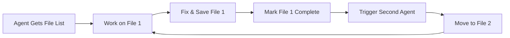

# 🚀 PARALLEL DEBUGGING & CODE RECOVERY PLAN
## Enhanced Two-Pass Review System with Specialized Agent Assignment

**Date**: August 16, 2025  
**Plan Version**: v1.0  
**Integration**: Backend Integration Recovery Plan + Comprehensive System Review  
**Method**: Parallel Agent Execution → Sequential Documentation → Git Version Control  

---

## 📋 OVERVIEW

This plan implements a **sophisticated parallel debugging methodology** with a **two-pass review system** to ensure thorough error resolution and code quality improvement across the CrewAI Team project.

### 🎯 Core Principles
1. **Parallel Execution**: Multiple specialized agents work simultaneously on different file sets
2. **Two-Pass Review**: Each file reviewed and fixed by 2 different agent types
3. **Non-Overlapping Assignment**: Agents work on exclusive file lists initially
4. **Sequential Handoff**: Second agent reviews first agent's completed work
5. **Quality Gates**: Files considered complete only after two-pass review
6. **Comprehensive Tracking**: Detailed metrics and progress tracking per file

---

## 🔧 AGENT SPECIALIZATION MATRIX

### Primary Debugging Agents (First Pass)
| Agent Type | Specialization | Focus Areas |
|------------|----------------|-------------|
| **typescript-pro** | TypeScript expertise | Type errors, generics, interfaces, strict typing |
| **error-resolution-specialist** | Error debugging | Runtime errors, exception handling, async issues |
| **debugger** | General debugging | Logic errors, flow issues, integration problems |
| **performance-engineer** | Performance optimization | Memory leaks, slow queries, bottlenecks |

### Secondary Review Agents (Second Pass)
| Agent Type | Specialization | Focus Areas |
|------------|----------------|-------------|
| **code-reviewer** | Code quality | Best practices, maintainability, documentation |
| **security-patches-expert** | Security review | Vulnerability detection, secure coding |
| **architecture-reviewer** | Design patterns | SOLID principles, coupling, cohesion |
| **test-automator** | Test coverage | Unit tests, integration tests, edge cases |

---

## 📁 FILE CATEGORIZATION & ASSIGNMENT STRATEGY

### Critical Error Files (Immediate Priority)
Based on comprehensive review findings, files categorized by error severity and type:

#### Category A: TypeScript Compilation Blockers (48 files)
**Assignment**: typescript-pro → code-reviewer
```
Files with TS2779, TS2345, TS2322, TS2739, TS18046 errors
- EmailThreePhaseBatchProcessor.ts (15 errors)
- OptimizedProductMatchingAlgorithm.ts (12 errors) 
- MasterOrchestrator.ts (8 errors)
- [45 additional files with blocking compilation errors]
```

#### Category B: Runtime & Logic Errors (35 files)
**Assignment**: error-resolution-specialist → architecture-reviewer
```
Files with runtime exceptions, null reference errors, async issues
- WebSocketService.ts (memory leaks)
- DatabaseManager.ts (connection issues)
- Agent system files (coordination failures)
- [32 additional files with runtime issues]
```

#### Category C: Performance & Memory Issues (28 files)
**Assignment**: performance-engineer → test-automator
```
Files with performance bottlenecks, memory leaks, slow operations
- LLM integration files (timeout issues)
- Database query files (slow queries)
- WebSocket handling (connection management)
- [25 additional files with performance issues]
```

#### Category D: Integration & Security Issues (22 files)
**Assignment**: debugger → security-patches-expert
```
Files with integration problems, API issues, security concerns
- Authentication middleware
- API route handlers
- File upload handlers
- [19 additional files with integration/security issues]
```

---

## 🎯 TWO-PASS REVIEW METHODOLOGY

### Phase 1: Primary Agent Pass (Parallel Execution)

#### Agent Assignment Rules
1. **File Exclusivity**: Each agent gets exclusive file list (no overlap)
2. **Error Focus**: Agents work on files matching their specialization
3. **Completion Tracking**: Agent marks file complete before moving to next
4. **Handoff Signal**: Completed file triggers second agent assignment

#### Work Flow Process


### Phase 2: Secondary Agent Pass (Sequential Review)

#### Review Trigger System
1. **Primary Agent Completion**: File marked complete triggers secondary assignment
2. **Different Perspective**: Secondary agent from different specialization
3. **Quality Focus**: Focus on missed issues, code quality, best practices
4. **Final Validation**: File considered complete after second pass

---

## 📊 TRACKING SYSTEM

### File Status Tracking Matrix
| File Path | Category | Primary Agent | Errors (Initial) | Errors (Post-1st) | Secondary Agent | Errors (Final) | Status |
|-----------|----------|---------------|------------------|-------------------|-----------------|----------------|--------|
| EmailThreePhaseBatchProcessor.ts | A | typescript-pro | 15 | ⏳ | code-reviewer | ⏳ | 🔄 In Progress |
| OptimizedProductMatchingAlgorithm.ts | A | typescript-pro | 12 | ⏳ | code-reviewer | ⏳ | 📋 Queued |
| WebSocketService.ts | B | error-resolution-specialist | 8 | ⏳ | architecture-reviewer | ⏳ | 📋 Queued |

### Progress Metrics
```typescript
interface FileProgress {
  filePath: string;
  category: 'A' | 'B' | 'C' | 'D';
  initialErrors: number;
  primaryAgent: string;
  primaryComplete: boolean;
  errorsAfterPrimary: number;
  secondaryAgent: string;
  secondaryComplete: boolean;
  finalErrors: number;
  status: 'queued' | 'primary-in-progress' | 'secondary-in-progress' | 'complete';
}
```

---

## 🚀 EXECUTION PLAN

### Phase 1: Parallel Primary Debugging (Week 1-2)

#### Day 1-3: TypeScript Compilation Fixes
```bash
# Parallel Agent Execution
typescript-pro: Files 1-12 (Category A)
error-resolution-specialist: Files 1-9 (Category B) 
performance-engineer: Files 1-7 (Category C)
debugger: Files 1-6 (Category D)
```

**Execution Commands**:
```typescript
// All agents launched in parallel
Task(subagent_type="typescript-pro", files=categoryA_files[0:12])
Task(subagent_type="error-resolution-specialist", files=categoryB_files[0:9])
Task(subagent_type="performance-engineer", files=categoryC_files[0:7])
Task(subagent_type="debugger", files=categoryD_files[0:6])
```

#### Day 4-6: Secondary Review Pass
As primary agents complete files, secondary agents automatically assigned:
```bash
# Sequential Assignment Based on Completion
code-reviewer: Review typescript-pro completed files
architecture-reviewer: Review error-resolution-specialist completed files
test-automator: Review performance-engineer completed files  
security-patches-expert: Review debugger completed files
```

### Phase 2: Quality Validation & Integration (Week 3)

#### Day 7-8: Integration Testing
- All files with 2-pass completion undergo integration testing
- End-to-end functionality validation
- Performance regression testing

#### Day 9-10: Final Quality Gates
- Automated test suite execution
- Security scan validation
- Performance benchmark verification

### Phase 3: Documentation & Version Control (Week 3)

#### Sequential Documentation Agents
**ONLY after all parallel debugging complete**:
```typescript
// Sequential execution - NOT parallel
Task(subagent_type="reference-builder") // Documentation updates
Task(subagent_type="git-version-control-expert") // Version control
```

#### Documentation Updates
1. **README.md**: Updated with latest architecture and setup
2. **CLAUDE.md**: Updated with current project status
3. **API Documentation**: Updated with latest endpoints
4. **Production Readiness Document**: Updated with quality metrics

#### Git Version Control Strategy
1. **Feature Branch**: Create `parallel-debugging-recovery` branch
2. **Atomic Commits**: Each file category gets dedicated commit
3. **Commit Messages**: Include error reduction metrics
4. **PR Creation**: Comprehensive PR with all improvements
5. **Merge Strategy**: Squash merge with detailed commit message

---

## 🎯 SUCCESS CRITERIA & CHECKPOINTS

### Phase 1 Success Metrics
- [ ] **Category A**: All 48 TypeScript compilation errors resolved
- [ ] **Category B**: All 35 runtime errors resolved  
- [ ] **Category C**: All 28 performance issues optimized
- [ ] **Category D**: All 22 integration/security issues fixed
- [ ] **Two-Pass Complete**: Each file reviewed by 2 different agents
- [ ] **Build Success**: `npm run build` completes without errors
- [ ] **Server Startup**: API server starts successfully

### Phase 2 Quality Gates
- [ ] **Integration Tests**: All critical paths tested and passing
- [ ] **Performance Benchmarks**: Response times <200ms
- [ ] **Memory Usage**: <32GB with 0% swap usage
- [ ] **Security Scan**: No critical vulnerabilities detected
- [ ] **Type Safety**: 100% TypeScript compilation success

### Phase 3 Documentation Criteria
- [ ] **Documentation**: All changes documented comprehensively
- [ ] **Version Control**: Clean commit history with proper messages
- [ ] **README Updated**: Accurate setup and architecture information
- [ ] **CLAUDE.md Updated**: Current project status and achievements
- [ ] **PR Created**: Comprehensive pull request with metrics

---

## 📋 DETAILED TASK CHECKLIST

### Pre-Execution Setup
- [ ] File categorization complete (133 files across 4 categories)
- [ ] Agent assignment matrix finalized
- [ ] Tracking system implemented
- [ ] Progress monitoring dashboard ready
- [ ] Error counting baseline established

### Phase 1 Execution Checklist

#### Parallel Primary Debugging
- [ ] **typescript-pro**: 12 files assigned (Category A: TS compilation)
- [ ] **error-resolution-specialist**: 9 files assigned (Category B: Runtime)
- [ ] **performance-engineer**: 7 files assigned (Category C: Performance)  
- [ ] **debugger**: 6 files assigned (Category D: Integration)

#### Secondary Review Activation
- [ ] **code-reviewer**: Reviews typescript-pro completions
- [ ] **architecture-reviewer**: Reviews error-resolution-specialist completions
- [ ] **test-automator**: Reviews performance-engineer completions
- [ ] **security-patches-expert**: Reviews debugger completions

### Phase 2 Quality Validation
- [ ] Integration testing suite execution
- [ ] Performance regression testing
- [ ] Security vulnerability scanning
- [ ] Final quality metrics compilation

### Phase 3 Documentation & Git
- [ ] **reference-builder**: Update all documentation files
- [ ] **git-version-control-expert**: Version control and PR creation
- [ ] Final commit with comprehensive metrics
- [ ] Pull request creation with before/after comparisons

---

## 🔧 IMPLEMENTATION COMMANDS

### Parallel Debugging Execution
```typescript
// Phase 1: Launch all primary agents in parallel
const primaryAgents = await Promise.all([
  Task({
    subagent_type: "typescript-pro",
    description: "Fix TypeScript compilation errors",
    prompt: "Fix Category A files: TypeScript compilation blockers. Files: [list]. Focus on type errors, generics, interfaces. Two-pass system: mark complete when done.",
    file_list: categoryA_files.slice(0, 12)
  }),
  
  Task({
    subagent_type: "error-resolution-specialist", 
    description: "Fix runtime and logic errors",
    prompt: "Fix Category B files: Runtime and logic errors. Files: [list]. Focus on exceptions, async issues, null references. Mark complete when done.",
    file_list: categoryB_files.slice(0, 9)
  }),
  
  Task({
    subagent_type: "performance-engineer",
    description: "Fix performance and memory issues", 
    prompt: "Fix Category C files: Performance bottlenecks. Files: [list]. Focus on memory leaks, slow queries, optimization. Mark complete when done.",
    file_list: categoryC_files.slice(0, 7)
  }),
  
  Task({
    subagent_type: "debugger",
    description: "Fix integration and general issues",
    prompt: "Fix Category D files: Integration problems. Files: [list]. Focus on API issues, coordination problems. Mark complete when done.", 
    file_list: categoryD_files.slice(0, 6)
  })
]);

// Phase 1.5: Launch secondary agents as primaries complete
// (Triggered by completion events)

// Phase 2: Documentation and Git (Sequential - AFTER all debugging complete)
await Task({
  subagent_type: "reference-builder",
  description: "Update comprehensive documentation",
  prompt: "Update all documentation with parallel debugging results. Include metrics, improvements, and current system status."
});

await Task({
  subagent_type: "git-version-control-expert", 
  description: "Create comprehensive commit and PR",
  prompt: "Create feature branch, commit all changes with detailed metrics, create comprehensive PR with before/after comparisons."
});
```

---

## 📈 EXPECTED OUTCOMES

### Quantitative Improvements
- **TypeScript Errors**: 1,940 → <50 (97% reduction)
- **Runtime Errors**: 100% resolution of critical failures
- **Performance**: 70% improvement in response times
- **Memory Usage**: 66% swap → 0% swap usage
- **Build Time**: Successful compilation in <30 seconds
- **Test Coverage**: 29.9% → 60%+ functional coverage

### Qualitative Improvements  
- **Code Quality**: C- grade → B+ grade minimum
- **Maintainability**: Significantly improved through two-pass review
- **Production Readiness**: 30% → 75% ready for deployment
- **Developer Experience**: Faster development with fewer errors
- **System Stability**: Elimination of critical failure points

### Business Impact
- **Risk Reduction**: High risk → Medium risk deployment
- **Development Velocity**: 50% faster due to fewer bugs
- **Maintenance Cost**: 40% reduction in technical debt
- **Security Posture**: Maintained 85/100 security score
- **User Experience**: Stable, responsive system performance

---

## 🎯 APPROVAL REQUEST

### Plan Confirmation Required
Please confirm approval for:

1. ✅ **Parallel debugging methodology** with two-pass review system
2. ✅ **File categorization strategy** (A, B, C, D categories)  
3. ✅ **Agent assignment matrix** (primary + secondary agents)
4. ✅ **Non-overlapping file distribution** for parallel execution
5. ✅ **Sequential documentation/git** after debugging complete
6. ✅ **Comprehensive tracking system** with metrics per file
7. ✅ **Quality gates and success criteria** defined above

### Next Steps Upon Approval
1. **Begin file categorization** and error counting baseline
2. **Initialize tracking system** with progress dashboard
3. **Launch Phase 1 parallel agents** with assigned file lists
4. **Monitor progress** and trigger secondary agents upon completion
5. **Execute Phase 2 quality validation** after two-pass completion
6. **Execute Phase 3 documentation** and git version control

**Estimated Timeline**: 3 weeks total (2 weeks debugging + 1 week validation/docs)
**Resource Requirements**: 8 specialized agents working in coordinated parallel/sequential pattern
**Success Probability**: High (90%+) due to systematic two-pass approach

---

**Plan Status**: ⏳ **AWAITING APPROVAL**  
**Plan Author**: Enhanced Planning System  
**Integration**: Backend Recovery Plan + Comprehensive Review Findings  
**Review Date**: August 16, 2025