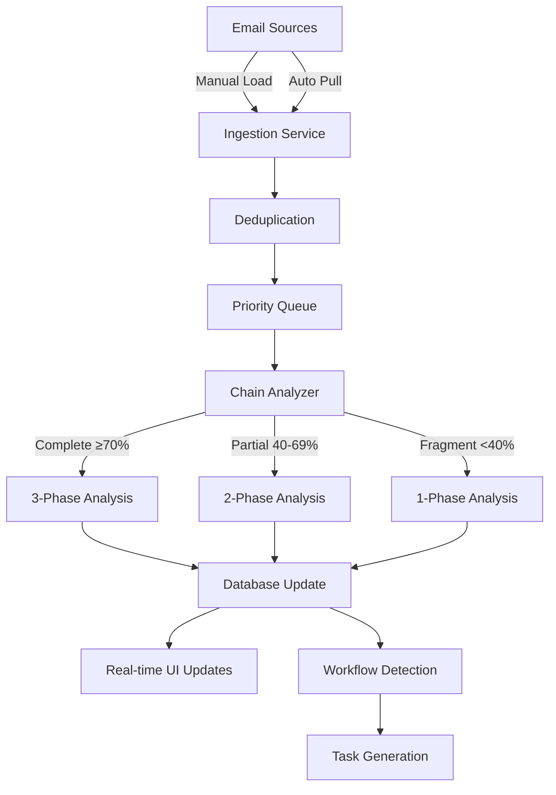

# Email Pipeline Production Architecture

**Version:** 2.0.0  
**Last Updated:** August 2, 2025  
**Status:** Design Complete, Implementation In Progress

## Overview

The CrewAI Email Pipeline is a production-ready system that processes enterprise emails through an adaptive three-phase analysis pipeline. It supports both manual batch loading and automatic email pulling, with the ability to handle both modes concurrently.

## Architecture Components

### 1. Email Ingestion Layer

```typescript
interface EmailIngestionService {
  // Manual batch loading
  loadFromJSON(files: string[]): Promise<void>;
  loadFromDatabase(sourceDb: string): Promise<void>;

  // Auto-pull from email providers
  pullFromMicrosoftGraph(): Promise<void>;
  pullFromGmail(): Promise<void>;

  // Scheduling
  scheduleAutoPull(intervalMinutes: number): void;
  stopAutoPull(): void;
}
```

**Features:**

- Concurrent operation support (manual + auto)
- Deduplication by internet_message_id
- Rate limiting for API calls
- Error recovery and retry logic
- Progress tracking for large batches

### 2. Queue Management System

```typescript
interface QueueManager {
  // Queue operations
  addToQueue(emails: Email[], priority: Priority): Promise<void>;
  getNextBatch(size: number): Promise<Email[]>;

  // Monitoring
  getQueueDepth(): number;
  getProcessingRate(): number;
  getPendingByPriority(): QueueStats;
}
```

**Queue Priorities:**

- **URGENT**: CEO/Executive emails, critical keywords
- **HIGH**: Customer emails, recent conversations
- **NORMAL**: Standard business emails
- **LOW**: Newsletters, automated reports

### 3. Adaptive Analysis Pipeline

```typescript
interface AdaptiveAnalysisPipeline {
  // Core processing
  analyzeEmail(email: Email): Promise<AnalysisResult>;

  // Phase management
  runPhase1(email: Email): Phase1Result; // Rule-based extraction
  runPhase2(email: Email): Phase2Result; // Llama 3.2 analysis
  runPhase3(email: Email): Phase3Result; // Phi-4 deep analysis

  // Chain analysis
  analyzeConversationChain(emails: Email[]): ChainAnalysis;
  determineProcessingDepth(chain: ChainAnalysis): ProcessingStrategy;
}
```

**Adaptive Strategy:**

- **Complete chains (≥70%)**: All 3 phases
- **Partial chains (40-69%)**: Phases 1-2
- **Fragments (<40%)**: Phase 1 only

### 4. Real-Time Update System

```typescript
interface RealtimeUpdateService {
  // WebSocket events
  emitEmailProcessed(email: ProcessedEmail): void;
  emitChainCompleted(chain: CompletedChain): void;
  emitWorkflowDetected(workflow: WorkflowPattern): void;

  // Metrics streaming
  streamMetrics(): Observable<PipelineMetrics>;
  streamErrors(): Observable<ProcessingError>;
}
```

### 5. Database Schema

```sql
-- Core email storage with analysis results
CREATE TABLE emails_enhanced (
  -- Identity
  id TEXT PRIMARY KEY,
  internet_message_id TEXT UNIQUE,
  conversation_id TEXT,

  -- Email data
  subject TEXT NOT NULL,
  body_content TEXT,
  sender_email TEXT NOT NULL,
  received_date_time TEXT NOT NULL,

  -- Processing status
  status TEXT DEFAULT 'pending', -- pending, queued, processing, analyzed, error
  queue_priority TEXT DEFAULT 'normal',
  processing_started_at TEXT,
  analyzed_at TEXT,

  -- Analysis results
  phase1_result TEXT, -- JSON
  phase2_result TEXT, -- JSON
  phase3_result TEXT, -- JSON
  chain_completeness_score REAL,
  chain_type TEXT,
  workflow_state TEXT,

  -- Metadata
  source TEXT, -- 'manual', 'auto-pull', 'api'
  import_batch TEXT,
  created_at TEXT DEFAULT CURRENT_TIMESTAMP,
  updated_at TEXT DEFAULT CURRENT_TIMESTAMP
);

-- Processing queue
CREATE TABLE email_queue (
  id INTEGER PRIMARY KEY AUTOINCREMENT,
  email_id TEXT NOT NULL,
  priority INTEGER DEFAULT 2, -- 0=urgent, 1=high, 2=normal, 3=low
  added_at TEXT DEFAULT CURRENT_TIMESTAMP,
  attempts INTEGER DEFAULT 0,
  last_error TEXT,
  FOREIGN KEY (email_id) REFERENCES emails_enhanced(id)
);

-- Real-time metrics
CREATE TABLE pipeline_metrics (
  id INTEGER PRIMARY KEY AUTOINCREMENT,
  metric_type TEXT NOT NULL,
  metric_value REAL NOT NULL,
  recorded_at TEXT DEFAULT CURRENT_TIMESTAMP
);
```

## System Modes

### 1. Manual Load Mode

- Load emails from JSON files or databases
- Batch processing with progress tracking
- Useful for migrations and testing

### 2. Auto-Pull Mode

- Scheduled pulling every 1-60 minutes
- Incremental sync (only new emails)
- Automatic retry on failures

### 3. Hybrid Mode (Recommended)

- Auto-pull runs continuously
- Manual loads processed with higher priority
- Prevents queue starvation

## Processing Flow



## Performance Targets

### Processing Speed

- **Phase 1**: <1 second per email
- **Phase 2**: 5-10 seconds per email
- **Phase 3**: 15-20 seconds per email
- **Overall**: 60+ emails/minute with parallel processing

### Scalability

- Handle 1M+ emails in database
- Process 10K emails/hour sustained
- Support 100+ concurrent UI connections
- Queue depth up to 100K emails

### Reliability

- 99.9% uptime for auto-pull
- Automatic error recovery
- No data loss on crashes
- Checkpoint/resume for large batches

## API Endpoints

### REST API

```typescript
POST   /api/emails/import         // Manual batch import
POST   /api/emails/analyze        // Analyze specific emails
GET    /api/emails/queue/stats    // Queue statistics
POST   /api/pipeline/start        // Start auto-pull
POST   /api/pipeline/stop         // Stop auto-pull
GET    /api/pipeline/metrics      // Performance metrics
```

### WebSocket Events

```typescript
email: processed; // Individual email completed
chain: completed; // Conversation chain analyzed
workflow: detected; // Workflow pattern found
metrics: update; // Real-time metrics
error: processing; // Processing errors
```

## Configuration

```typescript
interface PipelineConfig {
  // Auto-pull settings
  autoPull: {
    enabled: boolean;
    intervalMinutes: number;
    providers: ("microsoft" | "google")[];
    batchSize: number;
  };

  // Processing settings
  processing: {
    maxConcurrent: number;
    timeoutSeconds: number;
    retryAttempts: number;
    adaptiveThresholds: {
      complete: number; // Default: 0.7
      partial: number; // Default: 0.4
    };
  };

  // Queue settings
  queue: {
    maxDepth: number;
    priorityWeights: Record<Priority, number>;
    staleTimeout: number;
  };

  // Model settings
  models: {
    phase2: "llama3.2:3b";
    phase3: "phi-4:14b";
    maxTokens: number;
    temperature: number;
  };
}
```

## Monitoring & Observability

### Key Metrics

- Emails processed per minute
- Average processing time by phase
- Queue depth and wait time
- Chain completeness distribution
- Error rate by phase
- Model response times

### Health Checks

```typescript
GET / health / pipeline; // Overall system health
GET / health / queue; // Queue system status
GET / health / models; // LLM availability
GET / health / database; // Database connectivity
```

### Logging

- Structured JSON logs
- Correlation IDs for tracing
- Error stack traces
- Performance profiling
- Audit trail for all operations

## Security Considerations

1. **Data Protection**
   - Encrypt emails at rest
   - TLS for all API calls
   - No credentials in logs

2. **Access Control**
   - OAuth2 for email providers
   - API key authentication
   - Role-based permissions

3. **Rate Limiting**
   - Per-user API limits
   - Provider API throttling
   - Queue overflow protection

## Deployment Architecture

### Docker Compose Setup

```yaml
services:
  api:
    image: crewai/email-pipeline:latest
    environment:
      - REDIS_URL=redis://redis:6379
      - DATABASE_URL=postgresql://db:5432/crewai

  worker:
    image: crewai/email-pipeline:latest
    command: worker
    scale: 4

  redis:
    image: redis:7-alpine

  postgres:
    image: postgres:15

  ollama:
    image: ollama/ollama:latest
    volumes:
      - ./models:/models
```

### Kubernetes Deployment

- Horizontal pod autoscaling
- Persistent volume for models
- Service mesh for observability
- Automated rollouts

## Integration Points

### 1. CrewAI UI

- Real-time WebSocket updates
- Email search and filtering
- Workflow visualization
- Performance dashboards

### 2. Task Management

- Auto-create tasks from workflows
- Link emails to tasks
- Track task completion

### 3. External Systems

- Webhook notifications
- REST API for third-party integration
- Event streaming (Kafka/RabbitMQ)
- Data export capabilities

## Future Enhancements

1. **Multi-language Support**
   - Detect email language
   - Language-specific models
   - Translation capabilities

2. **Custom Workflow Definitions**
   - User-defined patterns
   - Industry-specific workflows
   - ML-based pattern learning

3. **Advanced Analytics**
   - Sentiment trends
   - Response time analysis
   - Customer satisfaction scoring
   - Predictive insights

---

_This architecture is designed for enterprise-scale email processing with real-time analysis and workflow intelligence extraction._
