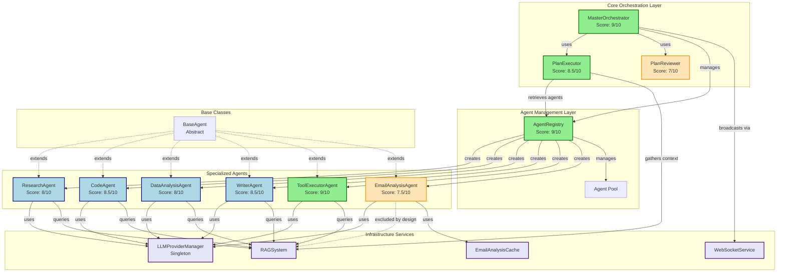
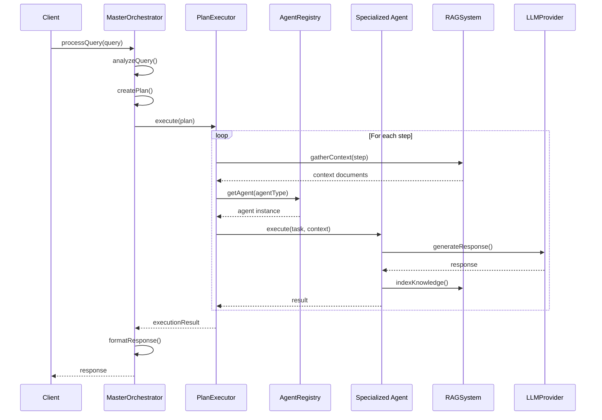
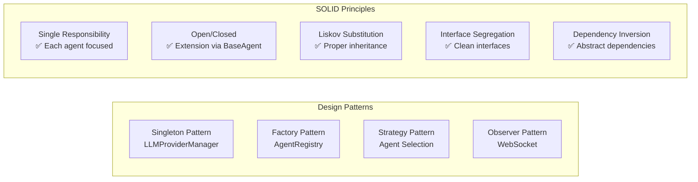
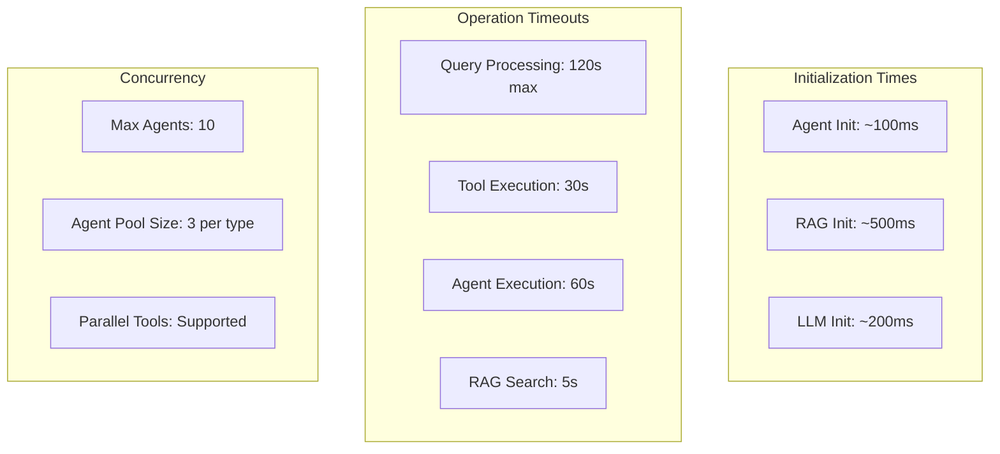
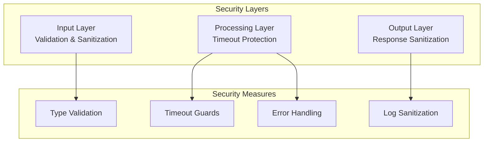

# CrewAI Agent System Architecture Diagram

## Component Relationships

## Data Flow Diagram

## Architecture Patterns

## Key Architectural Decisions

| Decision | Rationale | Impact |
|----------|-----------|---------|
| **Singleton LLMProvider** | Ensures single instance, reduces memory | ✅ Consistent model usage |
| **RAG Exclusion for EmailAgent** | Prevents circular dependencies | ✅ System stability |
| **Agent Pooling** | Reuse agents, reduce initialization | ✅ Performance improvement |
| **Lazy Loading** | Initialize only when needed | ✅ Faster startup |
| **Fallback Chains** | Resilience when primary fails | ✅ High availability |
| **WebSocket Updates** | Real-time progress tracking | ✅ Better UX |

## Performance Characteristics

## Security Architecture

## Overall System Health

| Component | Score | Status | Notes |
|-----------|-------|--------|-------|
| **MasterOrchestrator** | 9/10 | ✅ Excellent | Central hub working perfectly |
| **AgentRegistry** | 9/10 | ✅ Excellent | Clean factory pattern |
| **PlanExecutor** | 8.5/10 | ✅ Very Good | Robust execution engine |
| **ResearchAgent** | 8/10 | ✅ Good | Well integrated |
| **CodeAgent** | 8.5/10 | ✅ Very Good | Strong RAG integration |
| **DataAnalysisAgent** | 8/10 | ✅ Good | Proper patterns |
| **WriterAgent** | 8.5/10 | ✅ Very Good | Clean implementation |
| **ToolExecutorAgent** | 9/10 | ✅ Excellent | Great orchestration |
| **EmailAnalysisAgent** | 7.5/10 | ✅ Good | Isolated by design |
| **PlanReviewer** | 7/10 | ✅ Acceptable | Could be enhanced |

**Overall Architecture Score: 8.5/10** 🏆

The system demonstrates **production-ready architecture** with excellent pattern implementation and robust error handling.