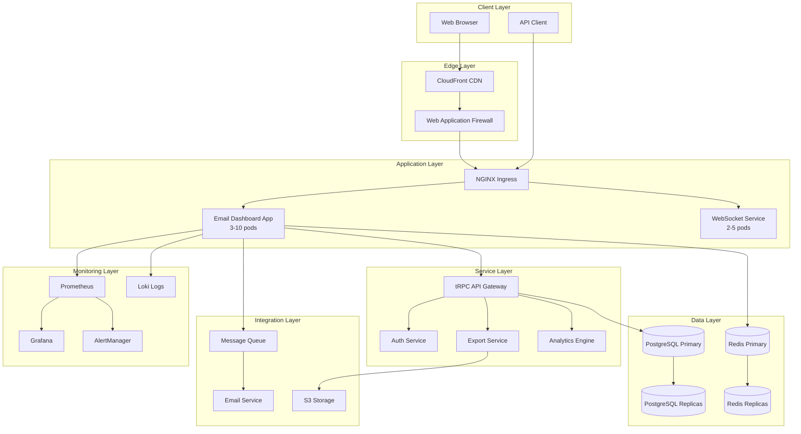
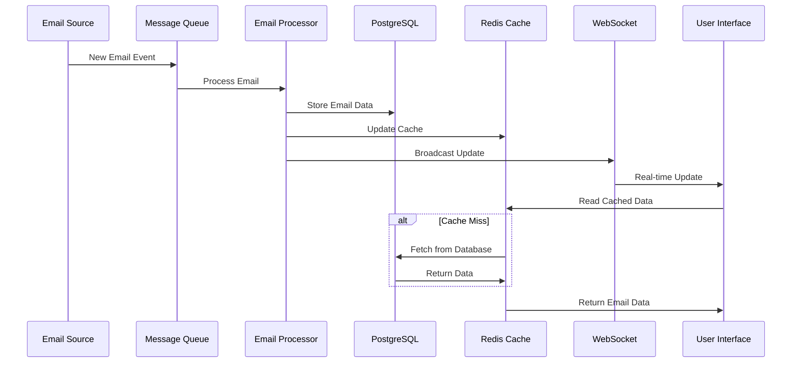
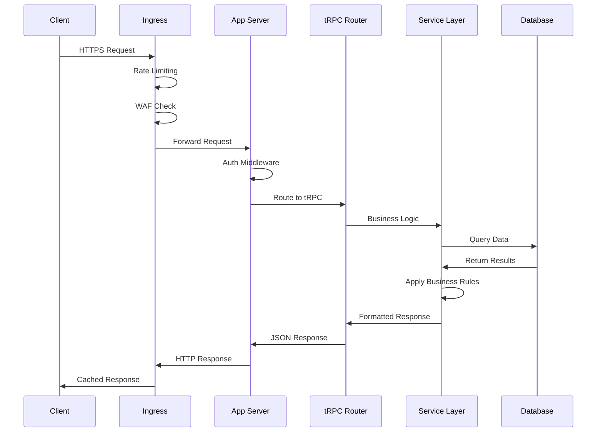
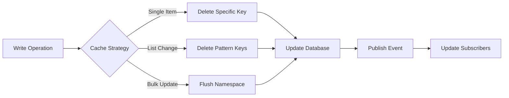
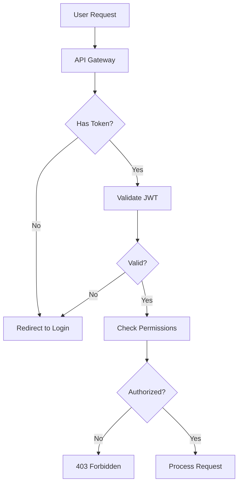
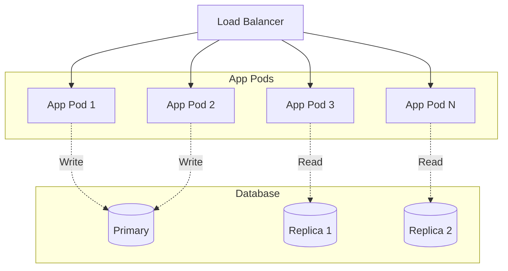
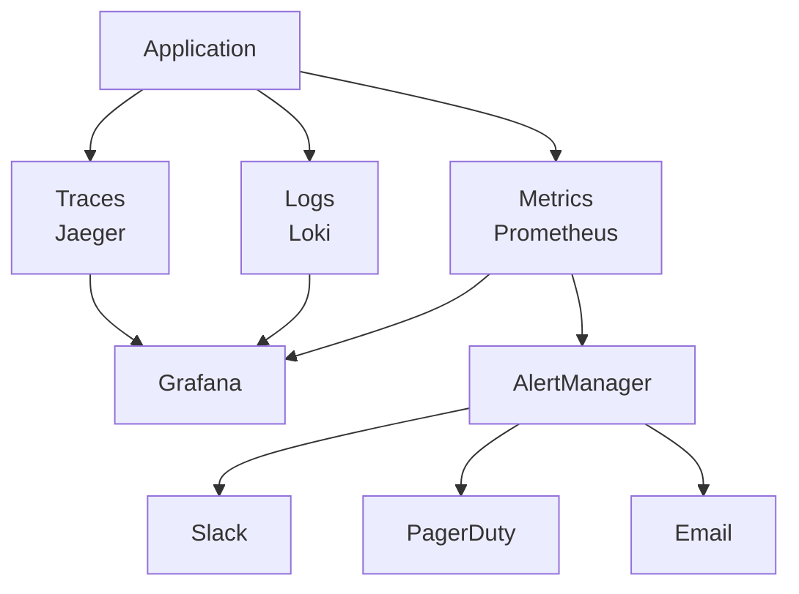
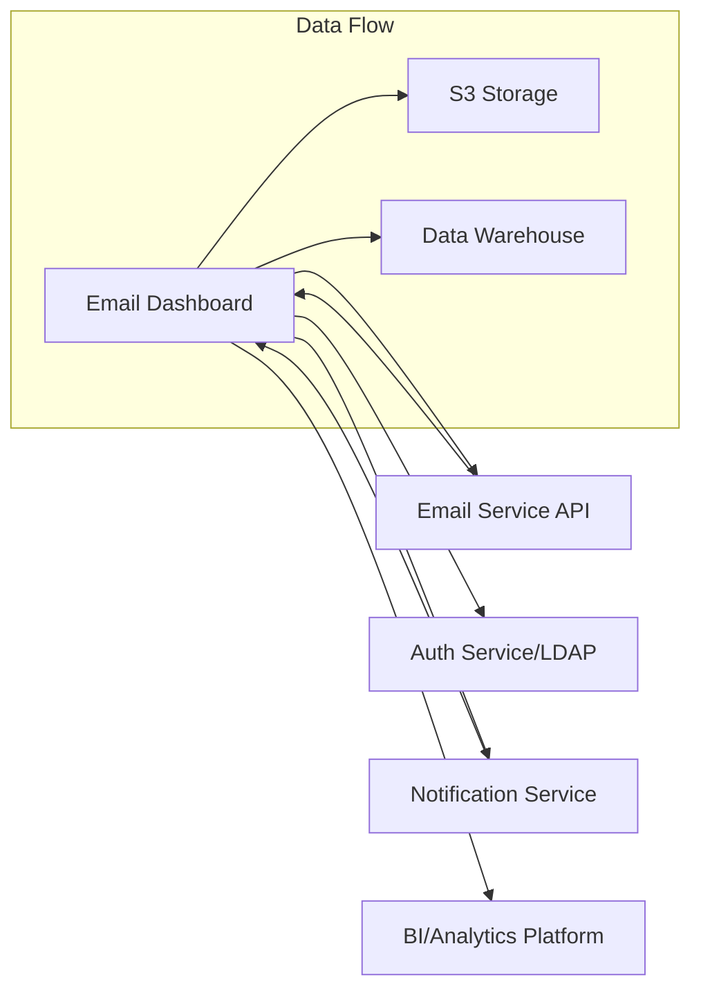
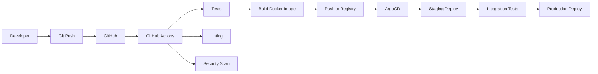

# Email Dashboard System Architecture

## Executive Summary

The Email Dashboard is a modern, scalable email management system built with React, TypeScript, and Node.js. It provides real-time email tracking, advanced filtering, analytics, and workflow management capabilities for TD SYNNEX operations.

### Key Technologies
- **Frontend**: React 18, TypeScript, TanStack Query, Chart.js
- **Backend**: Node.js, tRPC, WebSocket
- **Database**: PostgreSQL 15 with read replicas
- **Cache**: Redis 7 with Sentinel
- **Container**: Docker with Kubernetes orchestration
- **Monitoring**: Prometheus, Grafana, ELK Stack

## System Architecture Overview



## Component Architecture

### Frontend Architecture

```
src/
├── components/
│   ├── common/          # Shared components
│   ├── email/           # Email-specific components
│   │   ├── EmailTable.tsx
│   │   ├── EmailDashboard.tsx
│   │   └── StatusIndicator.tsx
│   ├── filters/         # Filter components
│   ├── analytics/       # Analytics/charts
│   └── export/          # Export functionality
├── hooks/               # Custom React hooks
├── services/            # API services
├── store/              # State management
├── types/              # TypeScript definitions
└── utils/              # Utility functions
```

### Backend Architecture

```
src/
├── api/
│   ├── trpc/           # tRPC routers
│   │   ├── email.router.ts
│   │   ├── analytics.router.ts
│   │   └── export.router.ts
│   ├── services/       # Business logic
│   │   ├── EmailStorageService.ts
│   │   ├── WebSocketService.ts
│   │   └── AnalyticsService.ts
│   └── middleware/     # Express middleware
├── core/
│   ├── cache/          # Caching layer
│   ├── database/       # Database utilities
│   ├── queue/          # Message queue
│   └── security/       # Security utilities
├── utils/              # Shared utilities
└── types/              # TypeScript types
```

## Data Flow Architecture

### Email Processing Pipeline



### API Request Flow



## Database Architecture

### Schema Design

```sql
-- Core Tables
CREATE TABLE emails (
    id UUID PRIMARY KEY DEFAULT gen_random_uuid(),
    email_alias VARCHAR(255) NOT NULL,
    requested_by VARCHAR(255) NOT NULL,
    subject TEXT NOT NULL,
    summary TEXT,
    status VARCHAR(50) NOT NULL,
    priority VARCHAR(20),
    workflow_id UUID,
    created_at TIMESTAMP DEFAULT CURRENT_TIMESTAMP,
    updated_at TIMESTAMP DEFAULT CURRENT_TIMESTAMP,
    metadata JSONB
);

CREATE TABLE email_status_history (
    id UUID PRIMARY KEY DEFAULT gen_random_uuid(),
    email_id UUID REFERENCES emails(id),
    previous_status VARCHAR(50),
    new_status VARCHAR(50),
    changed_by VARCHAR(255),
    comment TEXT,
    created_at TIMESTAMP DEFAULT CURRENT_TIMESTAMP
);

CREATE TABLE workflows (
    id UUID PRIMARY KEY DEFAULT gen_random_uuid(),
    name VARCHAR(255) NOT NULL,
    description TEXT,
    steps JSONB NOT NULL,
    created_at TIMESTAMP DEFAULT CURRENT_TIMESTAMP
);

-- Indexes for Performance
CREATE INDEX idx_emails_status ON emails(status);
CREATE INDEX idx_emails_created_at ON emails(created_at DESC);
CREATE INDEX idx_emails_requested_by ON emails(requested_by);
CREATE INDEX idx_emails_search ON emails USING gin(to_tsvector('english', 
    subject || ' ' || COALESCE(summary, '')));
```

### Data Partitioning Strategy

- **Time-based partitioning** for emails table (monthly)
- **List partitioning** for status (active vs archived)
- **Automatic partition management** via pg_partman

## Caching Architecture

### Redis Cache Structure

```
Cache Keys:
- email:{id}                     # Individual email
- emails:list:{hash}            # Paginated email lists
- analytics:summary:{date}      # Analytics summaries
- user:preferences:{userId}     # User preferences
- filters:presets:{userId}      # Saved filters

TTL Strategy:
- Individual emails: 1 hour
- List results: 5 minutes
- Analytics: 30 minutes
- User data: 24 hours
```

### Cache Invalidation



## Security Architecture

### Authentication & Authorization



### Security Layers

1. **Network Security**
   - WAF rules for common attacks
   - DDoS protection via CloudFront
   - TLS 1.3 for all connections

2. **Application Security**
   - JWT-based authentication
   - Role-based access control (RBAC)
   - Input validation and sanitization
   - CSRF protection
   - XSS prevention via CSP

3. **Data Security**
   - Encryption at rest (AES-256)
   - Encryption in transit (TLS)
   - PII data masking
   - Audit logging

## Scalability Design

### Horizontal Scaling

```yaml
Components:
- Application: 3-10 pods (CPU: 70%, Memory: 80%)
- WebSocket: 2-5 pods (Connections: 1000/pod)
- Database: 1 primary, 2 read replicas
- Redis: 1 primary, 2 replicas
```

### Load Distribution



## High Availability

### Fault Tolerance

1. **Application Layer**
   - Multi-AZ deployment
   - Health checks and auto-restart
   - Circuit breakers for external services

2. **Data Layer**
   - PostgreSQL streaming replication
   - Redis Sentinel for automatic failover
   - Regular automated backups

3. **Infrastructure**
   - Kubernetes self-healing
   - Pod disruption budgets
   - Node anti-affinity rules

### Disaster Recovery

- **RTO**: 30 minutes
- **RPO**: 5 minutes
- **Backup Schedule**: Every 6 hours
- **Backup Retention**: 30 days
- **DR Site**: Secondary region standby

## Performance Optimization

### Query Optimization

1. **Database Queries**
   - Prepared statements
   - Connection pooling (20 connections)
   - Query result caching
   - Materialized views for analytics

2. **API Optimization**
   - Response compression (gzip)
   - ETags for cache validation
   - Pagination for large datasets
   - Field selection (GraphQL-like)

### Frontend Optimization

1. **Bundle Optimization**
   - Code splitting by route
   - Tree shaking
   - Lazy loading components
   - CDN for static assets

2. **Runtime Performance**
   - Virtual scrolling for large lists
   - React.memo for expensive components
   - Web Workers for heavy computations
   - Service Worker for offline support

## Monitoring Architecture

### Metrics Collection

```
Application Metrics:
- Request rate and latency
- Error rates by endpoint
- Active user sessions
- WebSocket connections

Infrastructure Metrics:
- CPU and memory usage
- Disk I/O
- Network throughput
- Pod restart count

Business Metrics:
- Emails processed/hour
- Average response time
- SLA compliance
- User activity patterns
```

### Observability Stack



## Integration Architecture

### External Systems



### API Integration Patterns

1. **Synchronous APIs**
   - REST/tRPC for real-time operations
   - Circuit breaker pattern
   - Retry with exponential backoff

2. **Asynchronous Processing**
   - Message queue for email ingestion
   - Event-driven architecture
   - Webhook callbacks

## Development Architecture

### CI/CD Pipeline



### Environment Strategy

| Environment | Purpose | Data | Access |
|-------------|---------|------|--------|
| Development | Local development | Synthetic | Developers |
| Staging | Integration testing | Anonymized | Dev + QA |
| Production | Live system | Real | Limited |
| DR | Disaster recovery | Real (replica) | Emergency |

## Future Architecture Considerations

### Planned Enhancements

1. **Microservices Migration**
   - Extract email processing service
   - Separate analytics service
   - Independent export service

2. **Event Sourcing**
   - Complete audit trail
   - Time-travel debugging
   - Event replay capability

3. **ML Integration**
   - Email categorization
   - Priority prediction
   - Anomaly detection

4. **Multi-Region Deployment**
   - Active-active configuration
   - Global load balancing
   - Data residency compliance

---

*Architecture Version: 1.0*
*Last Updated: January 2025*
*Review Cycle: Quarterly*