# AI Agent Team Framework - System Interaction Diagram

## Overview

This document provides a comprehensive visual representation of how all components in the AI Agent Team Framework interact, including both current implementation status and data flow patterns.

## High-Level System Architecture

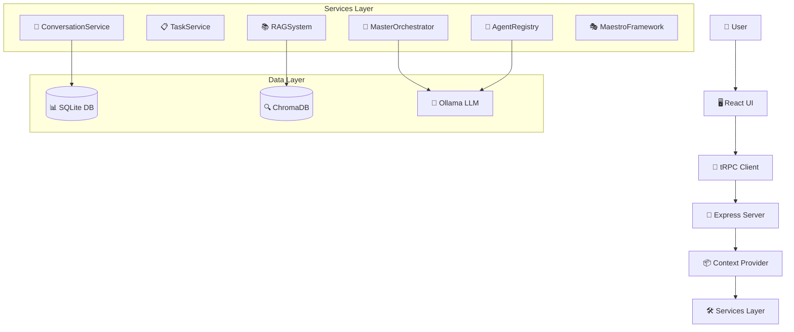

## Detailed Component Interaction Flow

### 1. User Query Processing Flow

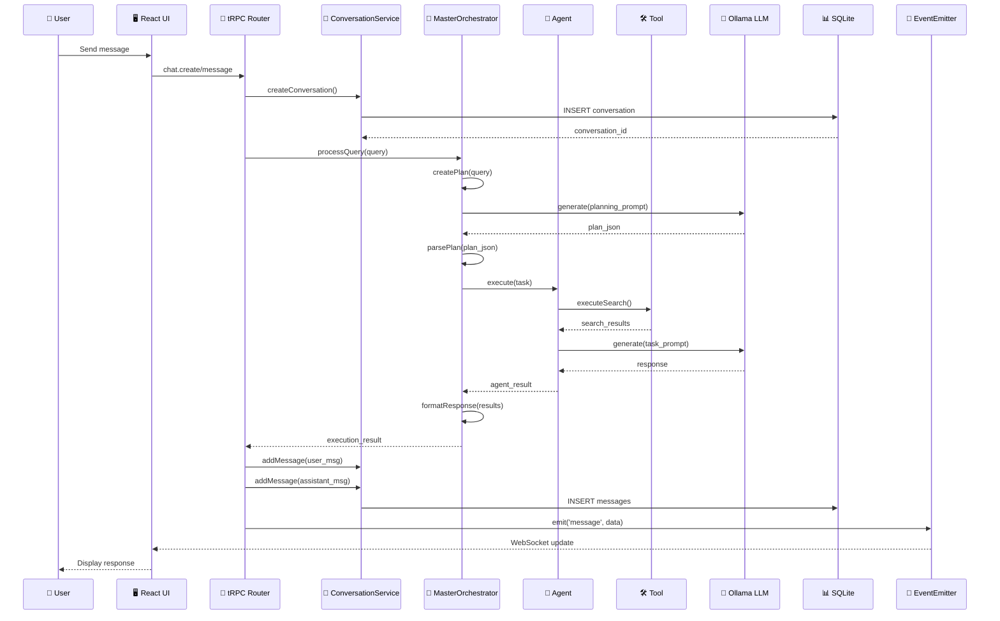

### 2. Service Initialization Flow

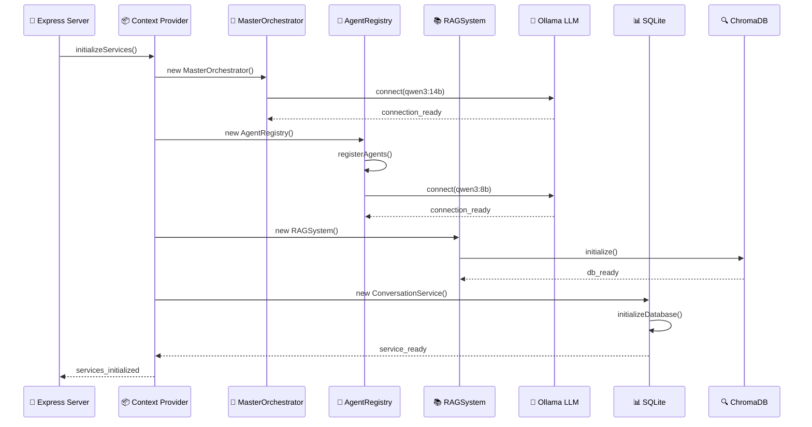

### 3. Agent Execution Flow

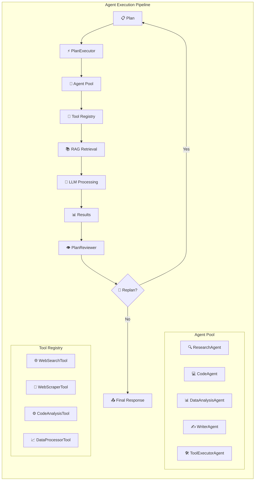

### 4. Data Flow Patterns

#### Current Mock Data Flow
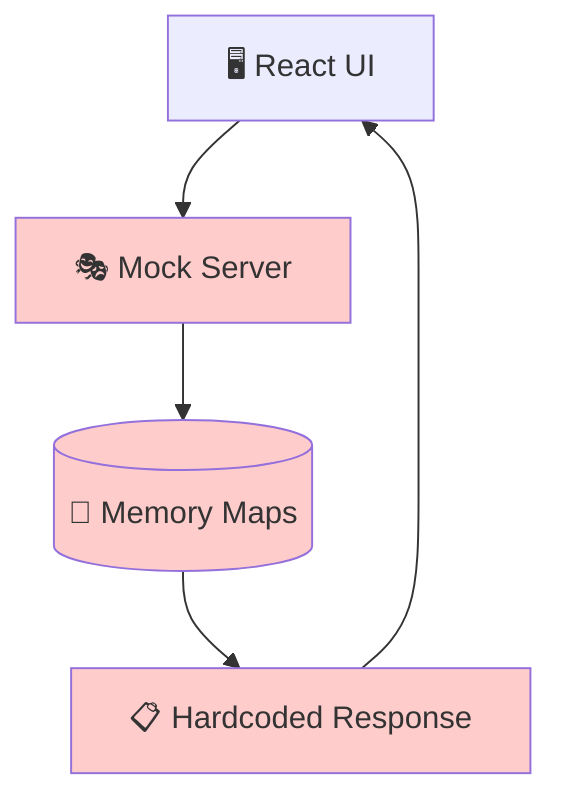

#### Production Data Flow
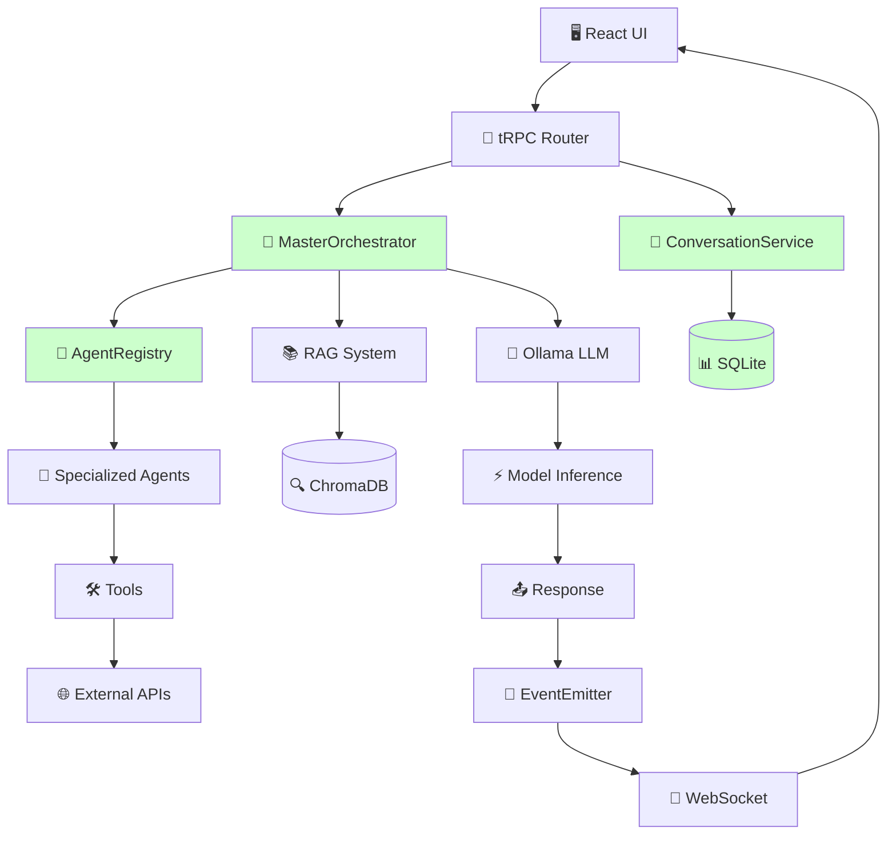

## Component Status Matrix

### ✅ Production Ready Components

| Component | Status | Description |
|-----------|--------|-------------|
| ConversationService | ✅ Complete | SQLite-based persistence with full CRUD operations |
| tRPC Infrastructure | ✅ Complete | Type-safe API layer with error handling |
| React UI | ✅ Complete | Full chat interface with real-time updates |
| Database Schema | ✅ Complete | Proper SQLite tables with relationships |
| Service Architecture | ✅ Complete | Clean separation of concerns |

### 🚧 Partially Implemented Components

| Component | Status | Missing Implementation |
|-----------|--------|----------------------|
| MasterOrchestrator | 🚧 Structured | `initialize()`, `createPlan()` LLM integration |
| AgentRegistry | 🚧 Structured | Agent business logic implementation |
| RAGSystem | 🚧 Structured | ChromaDB integration, document processing |
| WebSearchTool | 🚧 Structured | Real API connections, content extraction |
| OllamaProvider | 🚧 Structured | Connection initialization and error handling |

### ❌ Not Yet Implemented

| Component | Status | Required Implementation |
|-----------|--------|----------------------|
| ChromaDB Integration | ❌ Missing | Vector database setup and document storage |
| Tool Implementations | ❌ Missing | Actual tool functionality and API connections |
| Authentication | ❌ Missing | JWT verification and user management |
| Agent Business Logic | ❌ Missing | Core agent processing capabilities |

## Critical Data Flow Gaps

### 1. LLM Integration Gap
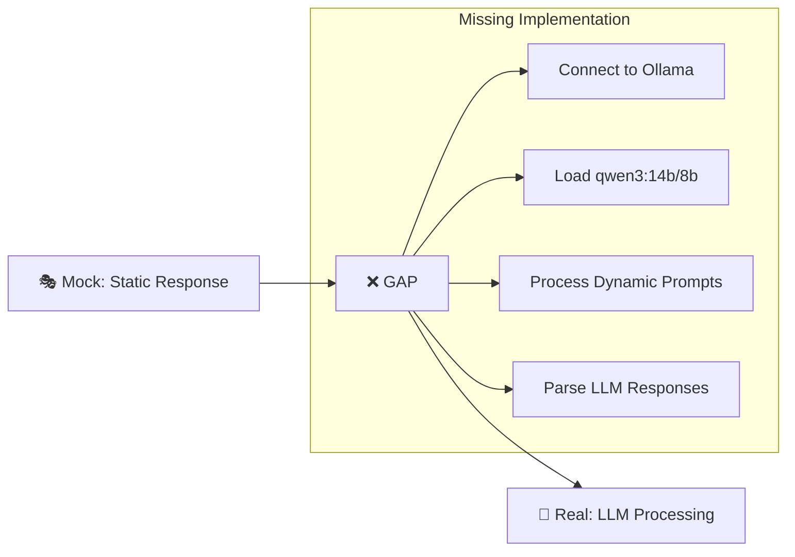

### 2. Agent Execution Gap
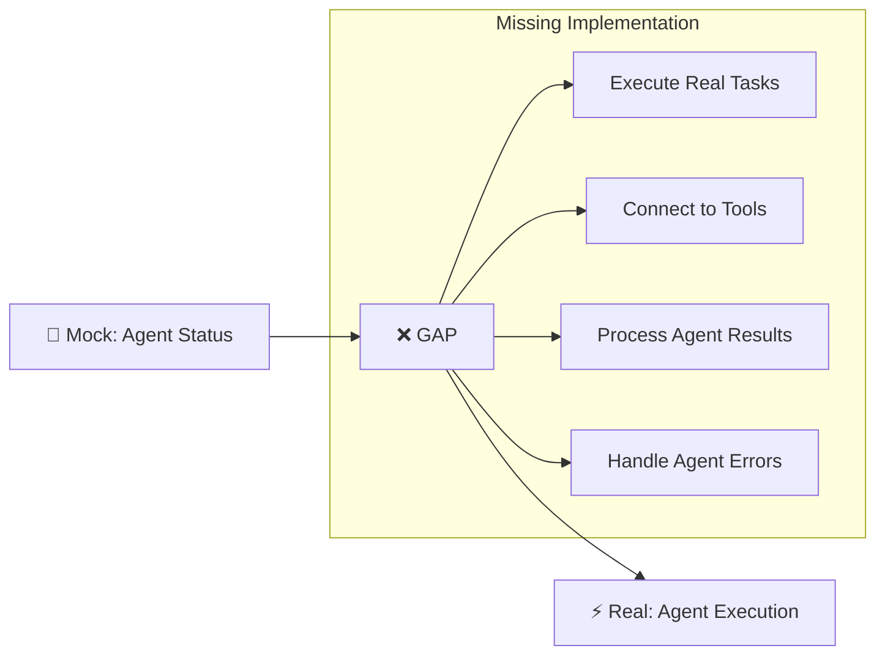

### 3. RAG System Gap
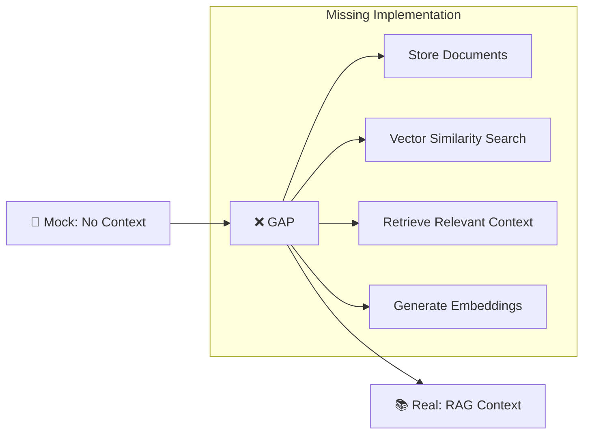

## Implementation Priority Matrix

### Phase 1: Core LLM Integration (High Priority)
```mermaid
graph TD
    A[🎯 MasterOrchestrator.initialize()] --> B[🧠 Ollama Connection]
    B --> C[📋 Plan Generation]
    C --> D[🔄 Basic Agent Execution]
    D --> E[📤 Response Formatting]
```

### Phase 2: Agent Implementation (Medium Priority)
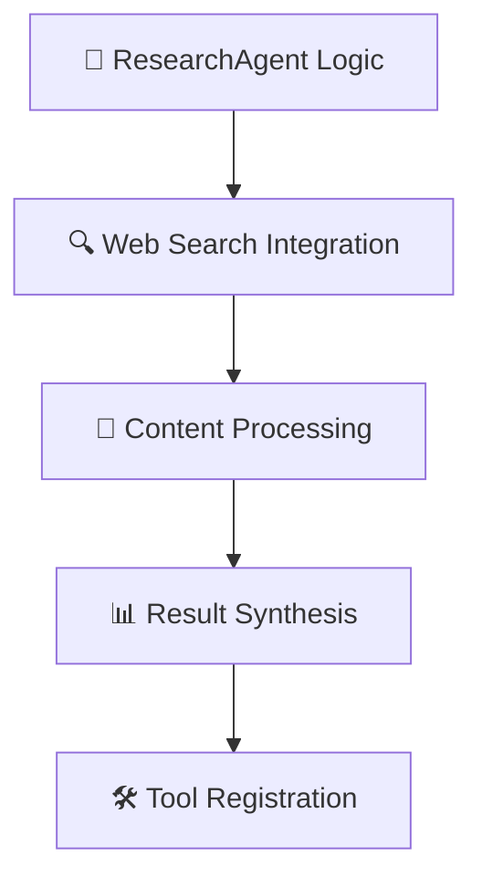

### Phase 3: RAG Enhancement (Lower Priority)
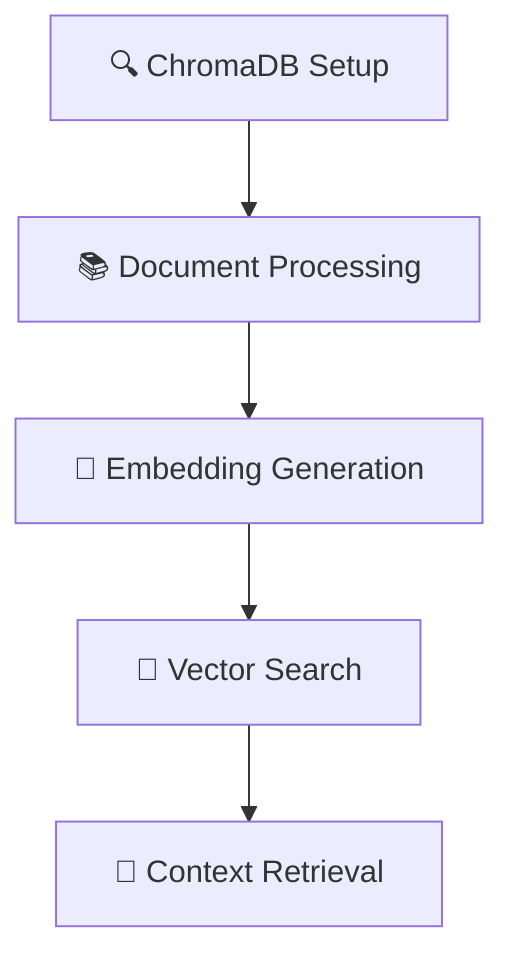

## Development Workflow Integration

### Current Development Flow
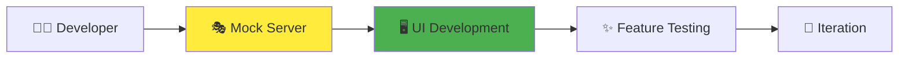

### Target Production Flow
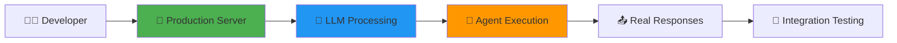

## WebSocket Real-Time Flow

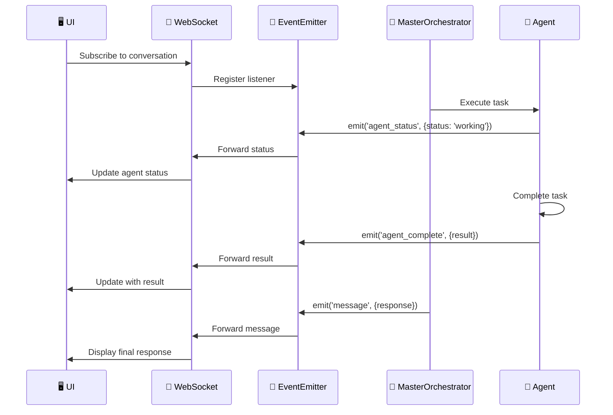

## Error Handling Flow

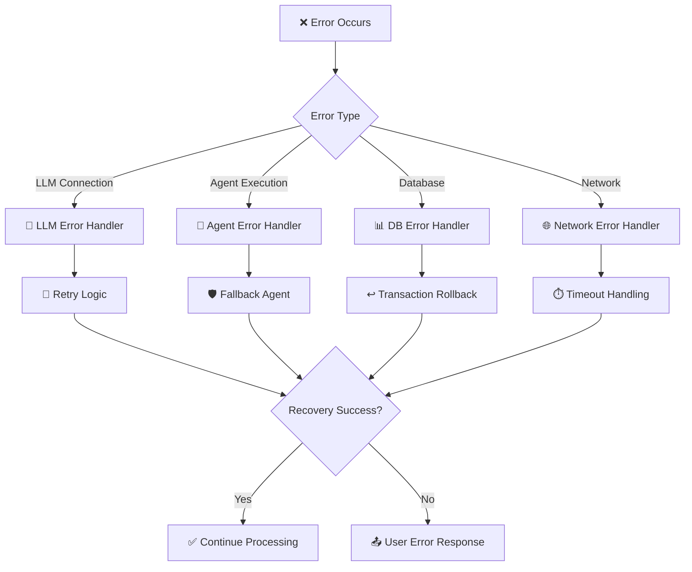

## Performance Optimization Points

### 1. Connection Pooling
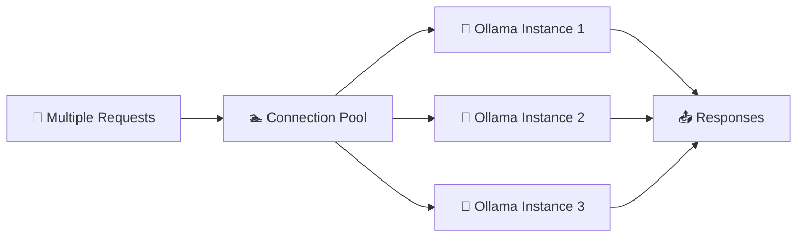

### 2. Caching Strategy
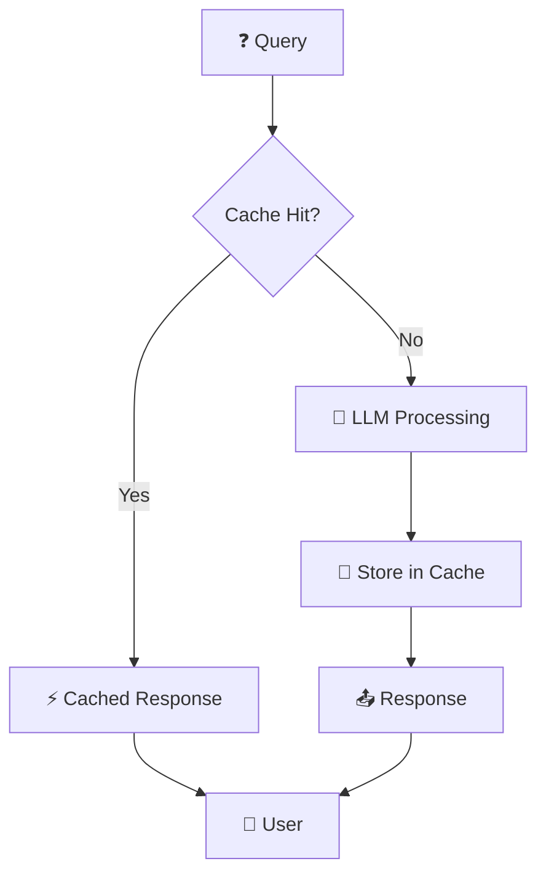

### 3. Batch Processing
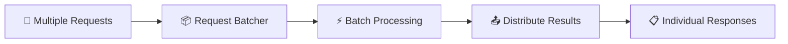

## Security Architecture

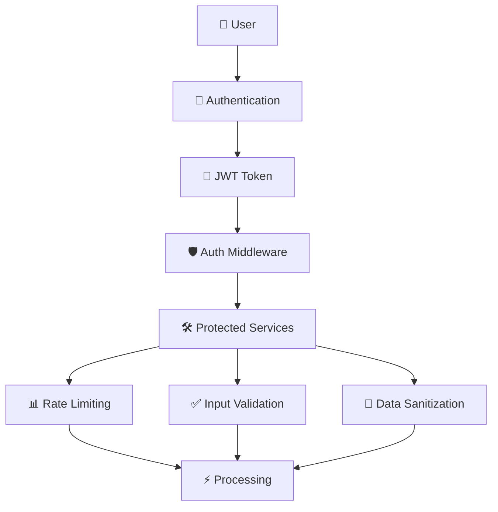

## Deployment Architecture

```mermaid
graph TB
    subgraph "Production Environment"
        LoadBalancer[⚖️ Load Balancer]
        App1[🚀 App Instance 1]
        App2[🚀 App Instance 2]
        App3[🚀 App Instance 3]
        
        LoadBalancer --> App1
        LoadBalancer --> App2
        LoadBalancer --> App3
        
        App1 --> SharedDB[(📊 Shared SQLite)]
        App2 --> SharedDB
        App3 --> SharedDB
        
        App1 --> OllamaCluster[🧠 Ollama Cluster]
        App2 --> OllamaCluster
        App3 --> OllamaCluster
        
        App1 --> ChromaCluster[🔍 ChromaDB Cluster]
        App2 --> ChromaCluster
        App3 --> ChromaCluster
    end
```

## Key Implementation Notes

### 1. Singleton Pattern Usage
- All services are initialized once and shared across requests
- Connection pooling ensures efficient resource utilization
- State management is handled through database persistence

### 2. Event-Driven Architecture
- Real-time updates through EventEmitter pattern
- WebSocket subscriptions for live UI updates
- Loose coupling between components

### 3. Type Safety
- Complete TypeScript coverage across all components
- tRPC ensures type-safe client-server communication
- Zod schemas for runtime validation

### 4. Error Recovery
- Graceful degradation when components fail
- Fallback mechanisms for LLM failures
- Transaction rollback for database errors

### 5. Scalability Considerations
- Horizontal scaling through multiple app instances
- Database connection pooling
- Caching strategies for frequently accessed data

## Conclusion

The AI Agent Team Framework is architecturally sound with a clear separation of concerns. The main gaps are in the business logic implementation rather than structural issues. The transition from mock to production can be achieved incrementally by implementing the missing LLM integration and agent execution logic while maintaining the existing UI and service architecture.

The system is designed for production scalability with proper error handling, real-time capabilities, and performance optimization points already identified and structured for implementation.