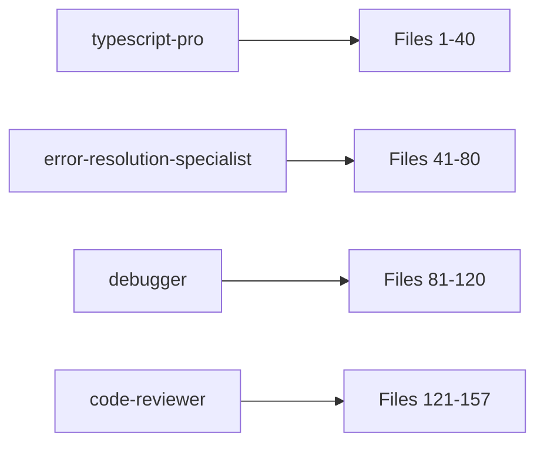

# Parallel Debug Action Plan - Enhanced Build Fix Strategy
**Date:** 2025-08-22
**Current State:** 1,488 build errors, 931 TypeScript errors across 157 files
**Objective:** Parallel debugging with double-review process for zero-defect deployment

## 🚀 Enhanced Parallel Debugging Strategy

### Core Principle: Divide, Debug, Double-Review
- **Parallel Processing:** Multiple expert agents work simultaneously on different files
- **No Overlap:** Each agent has exclusive file assignments initially
- **Double-Review:** Every file gets reviewed twice by different agents
- **Sequential Documentation:** Document and commit only after all reviews complete

## 📊 File Distribution Matrix

### Total Files with Errors: 157 files
Distribution across 4 primary agents + 4 review agents

### Initial Agent Assignments

#### Agent 1: typescript-pro (40 files)
**Focus:** Complex type errors, generics, interfaces
```
Files 1-40:
- src/api/middleware/*.ts (10 files)
- src/api/routes/*.ts (10 files)
- src/api/services/*.ts (10 files)
- src/api/validation/*.ts (10 files)
```

#### Agent 2: error-resolution-specialist (40 files)
**Focus:** Runtime errors, undefined types, mock data
```
Files 41-80:
- src/core/**/*.ts (15 files)
- src/database/**/*.ts (15 files)
- src/shared/**/*.ts (10 files)
```

#### Agent 3: debugger (40 files)
**Focus:** Logic errors, test failures, integration issues
```
Files 81-120:
- src/ui/components/**/*.tsx (20 files)
- src/ui/hooks/**/*.ts (10 files)
- src/ui/pages/**/*.tsx (10 files)
```

#### Agent 4: code-reviewer (37 files)
**Focus:** Code quality, patterns, security issues
```
Files 121-157:
- src/test/**/*.test.ts (15 files)
- src/microservices/**/*.ts (12 files)
- src/config/**/*.ts (10 files)
```

## 🔄 Double-Review Workflow

### Phase 1: Initial Parallel Debug (4 agents working simultaneously)



### Phase 2: Cross-Review Process
When each agent completes a file, spawn a review agent:

```
typescript-pro completes File 1 → spawn code-reviewer-2 for File 1
error-resolution-specialist completes File 41 → spawn typescript-pro-2 for File 41
debugger completes File 81 → spawn error-specialist-2 for File 81
code-reviewer completes File 121 → spawn debugger-2 for File 121
```

### Phase 3: Documentation & Version Control
After all files reviewed twice:
1. docs-architect agent documents all changes
2. git-version-control-expert commits with proper history

## 📋 Execution Plan with Agent Commands

### Phase 0: Setup & Baseline (5 minutes)

```bash
# Create tracking system
cat > file-tracking.json << 'EOF'
{
  "files": [],
  "phase1_agents": {
    "typescript-pro": { "assigned": [], "completed": [], "errors_fixed": 0 },
    "error-resolution-specialist": { "assigned": [], "completed": [], "errors_fixed": 0 },
    "debugger": { "assigned": [], "completed": [], "errors_fixed": 0 },
    "code-reviewer": { "assigned": [], "completed": [], "errors_fixed": 0 }
  },
  "phase2_reviews": {},
  "completion_status": "pending"
}
EOF

# Get error baseline
npm run typecheck 2>&1 | tee baseline-errors.txt
npm run build 2>&1 | tee baseline-build.txt
```

### Phase 1: Parallel Initial Debug (2-3 hours)

**Execute all 4 agents in parallel:**

```typescript
// Agent Task Definitions
const parallelDebugTasks = [
  {
    agent: "typescript-pro",
    prompt: `Fix TypeScript errors in these files:
      - src/api/middleware/*.ts
      - src/api/routes/*.ts
      - src/api/services/*.ts
      - src/api/validation/*.ts
      
      Focus on:
      - Complex type errors (TS2339, TS2345, TS2322)
      - Generic type issues
      - Interface mismatches
      - Strict null checks
      
      For each file:
      1. Read current errors
      2. Fix all TypeScript issues
      3. Ensure no placeholder/mock data
      4. Update file-tracking.json
      5. Move to next file
      
      Do NOT work on files assigned to other agents.`
  },
  {
    agent: "error-resolution-specialist",
    prompt: `Fix runtime and undefined type errors in these files:
      - src/core/**/*.ts
      - src/database/**/*.ts
      - src/shared/**/*.ts
      
      Focus on:
      - Undefined types
      - Mock data replacement with real implementations
      - Runtime error potential
      - Null/undefined handling
      
      For each file:
      1. Identify all error patterns
      2. Replace mock data with production code
      3. Fix undefined references
      4. Update file-tracking.json
      5. Move to next file`
  },
  {
    agent: "debugger",
    prompt: `Debug logic and integration issues in these files:
      - src/ui/components/**/*.tsx
      - src/ui/hooks/**/*.ts
      - src/ui/pages/**/*.tsx
      
      Focus on:
      - React component errors
      - Hook dependencies
      - State management issues
      - Event handler problems
      
      For each file:
      1. Analyze component logic
      2. Fix React-specific issues
      3. Ensure proper TypeScript in TSX
      4. Update file-tracking.json
      5. Move to next file`
  },
  {
    agent: "code-reviewer",
    prompt: `Review and fix code quality issues in these files:
      - src/test/**/*.test.ts
      - src/microservices/**/*.ts
      - src/config/**/*.ts
      
      Focus on:
      - Test implementation errors
      - Security vulnerabilities
      - Code patterns and practices
      - Configuration issues
      
      For each file:
      1. Review for best practices
      2. Fix anti-patterns
      3. Ensure security standards
      4. Update file-tracking.json
      5. Move to next file`
  }
];
```

### Phase 2: Cross-Review Process (1-2 hours)

**Dynamic review agent spawning:**

```typescript
// Review Agent Task Template
const reviewAgentTask = (originalAgent: string, fileCompleted: string) => ({
  agent: getReviewAgent(originalAgent),
  prompt: `Second review of ${fileCompleted} after ${originalAgent} fixes:
    
    1. Read the file and check for:
       - Any remaining TypeScript errors
       - Missed mock/placeholder data
       - Logic issues not caught
       - Security vulnerabilities
       - Performance problems
    
    2. Fix any issues found
    3. Update file-tracking.json with second review metrics
    4. Mark file as "double-reviewed"
    
    Previous agent fixed X errors. Your review should ensure 100% completion.`
});

function getReviewAgent(originalAgent: string): string {
  const reviewMatrix = {
    "typescript-pro": "code-reviewer",
    "error-resolution-specialist": "typescript-pro",
    "debugger": "error-resolution-specialist",
    "code-reviewer": "debugger"
  };
  return reviewMatrix[originalAgent];
}
```

### Phase 3: Final Validation (30 minutes)

```bash
# Run comprehensive checks
npm run typecheck 2>&1 | tee final-typecheck.txt
npm run build 2>&1 | tee final-build.txt
npm run test:unit -- --run

# Compare results
echo "=== Error Reduction Report ===" > improvement-report.md
echo "Baseline TypeScript: $(grep error baseline-errors.txt | wc -l)" >> improvement-report.md
echo "Final TypeScript: $(grep error final-typecheck.txt | wc -l)" >> improvement-report.md
echo "Baseline Build: $(grep error baseline-build.txt | wc -l)" >> improvement-report.md
echo "Final Build: $(grep error final-build.txt | wc -l)" >> improvement-report.md
```

### Phase 4: Documentation (30 minutes)

**Sequential execution:**

```typescript
const documentationTask = {
  agent: "docs-architect",
  prompt: `Document all debugging work completed:
    
    1. Read file-tracking.json for complete history
    2. Create comprehensive report including:
       - Files fixed by each agent
       - Error counts before/after
       - Types of issues resolved
       - Double-review findings
    
    3. Update:
       - README.md with current state
       - CHANGELOG.md with fixes
       - docs/DEBUGGING-REPORT.md with details
       - Claude memory with learnings
    
    4. Generate PDR (Problem Detection Report) with:
       - Root cause analysis
       - Prevention strategies
       - Architectural improvements needed`
};
```

### Phase 5: Version Control (15 minutes)

**Sequential execution:**

```typescript
const gitTask = {
  agent: "git-version-control-expert",
  prompt: `Commit all debugging work with proper version control:
    
    1. Review all changes from parallel agents
    2. Create atomic commits by category:
       - fix(types): TypeScript error resolutions
       - fix(runtime): Runtime error fixes  
       - fix(components): React component fixes
       - fix(tests): Test suite repairs
    
    3. Create comprehensive commit message with:
       - Summary of errors fixed
       - Agents involved
       - Files affected
       - Metrics improved
    
    4. Tag release as v1.1.0-debug-complete
    5. Create PR with full description`
};
```

## 📊 Tracking Dashboard

### File Progress Tracker
```json
{
  "file": "src/api/middleware/auth.ts",
  "initial_errors": 12,
  "phase1_agent": "typescript-pro",
  "phase1_errors_fixed": 10,
  "phase1_remaining": 2,
  "phase2_agent": "code-reviewer",  
  "phase2_errors_fixed": 2,
  "final_status": "clean",
  "review_notes": "Fixed type inference issue missed in phase 1"
}
```

### Success Metrics
| Metric | Target | Current | Status |
|--------|--------|---------|--------|
| TypeScript Errors | 0 | 931 | 🔴 In Progress |
| Build Errors | 0 | 1488 | 🔴 In Progress |
| Files Reviewed 2x | 157 | 0 | 🔴 Pending |
| Test Coverage | 80% | Unknown | 🔴 Pending |
| Documentation Updated | 100% | 0% | 🔴 Pending |

## ✅ Approval Checklist

### Pre-Execution
- [ ] All agents available and configured
- [ ] File assignments clearly defined
- [ ] Tracking system initialized
- [ ] Baseline metrics captured
- [ ] Git branch prepared

### Phase 1 Completion
- [ ] All 4 primary agents completed their files
- [ ] No file overlap occurred
- [ ] Tracking updated for each file
- [ ] Initial error reduction achieved

### Phase 2 Completion  
- [ ] Every file reviewed twice
- [ ] Cross-review findings documented
- [ ] All critical issues resolved
- [ ] Final validation passing

### Final Sign-off
- [ ] Zero TypeScript errors
- [ ] Zero build errors
- [ ] All tests passing
- [ ] Documentation complete
- [ ] Git history clean

## 🚀 Execution Commands

### Start Parallel Debug Phase 1
```bash
# Execute all agents in parallel
npm run clean && npm run typecheck > baseline.txt

# Launch parallel agents (execute simultaneously)
```

### Monitor Progress
```bash
# Real-time tracking
watch -n 5 'cat file-tracking.json | jq .phase1_agents'

# Error count monitoring
watch -n 10 'npm run typecheck 2>&1 | grep error | wc -l'
```

### Validate Completion
```bash
# Final checks
npm run build && npm run test && echo "✅ All systems operational"
```

---

**Note:** This plan ensures systematic, parallel debugging with quality assurance through double-review. No file is considered complete until reviewed twice, ensuring maximum error detection and resolution.

**Critical:** Agents must not overlap file assignments in Phase 1. Cross-review in Phase 2 ensures comprehensive coverage.